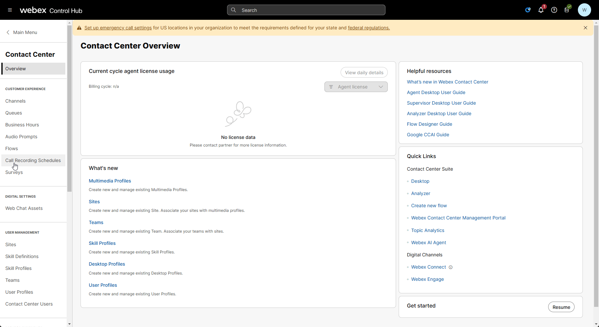

## Story

In this lab, you will complete a mission to enhance customer feedback collection by integrating a survey into the Webex Contact Center call flow. The lab is designed to be simple yet practical, focusing on minimal configuration within the Flow Designer, while leveraging a preconfigured survey template.

> **

Good to Know [Optional]
**
> 
> Supported Survey Question Types in Webex Contact Center
> 
> 1. **Customer Satisfaction (CSAT)**:
>     - Purpose: Measure satisfaction with a specific interaction or service.
>     - Example Question: "On a scale of 1 to 5, how satisfied are you with the service you received today?"
>     - Use Case: Assess overall satisfaction at the end of a call or interaction.
> 2. **Customer Effort Score (CES)**:
>     - Purpose: Evaluate the ease of resolving a customer's issue or completing a task.
>     - Example Question: "On a scale of 1 to 5, how easy was it to complete your task today?"
>     - Use Case: Identify pain points in the customer journey or process efficiency.
> 3. **Net Promoter Score (NPS)**:
>     - Purpose: Measure customer loyalty and the likelihood of recommending the service.
>     - Example Question: "On a scale of 0 to 10, how likely are you to recommend our service to a friend or colleague?"
>   - Use Case: Gauge long-term customer loyalty and brand advocacy.
> 

## Call Flow Overview

1. A new call enters the flow.  
2. The flow executes the logic to enable survey functionality. 
3. Agent answers the call. 
4. The flow triggers an event when the agent disconnects from the call. 
5. The caller remains on the line and hears the survey menu. 

## Mission Details

Your mission is to:

1. Integrate a preconfigured survey into the call flow using the Flow Designer.
2. Configure basic logic to determine when to route customers to the survey (e.g., after a call ends).
3. Understand how Webex Contact Center supports various survey question types, including CSAT, CES, and NPS.

!!! Note
    The survey is prebuilt and includes key questions designed to gather actionable insights from customers. Your task is to focus on configuring the flow and ensuring the survey is triggered seamlessly during the customer journey.

### Pre-configured entities      
     
- Survey: **Webex CC 2025**
- System defined GlobalVariable: **Global_FeedbackSurveyOptIn**

[Optional]
    In case you don't want to use pre-configured Survey you can configure your own. Expand below section to create your own Survey otherwise proceed to **Build** section below

**

Create your own Survey [Optional]
**

- Download audio prompts from the [shared folder](https://drive.google.com/drive/folders/1vS2aXgaCzorGAmGdQ7bP2NJMHNQx2ais?usp=sharing){:target="_blank"}.

- In **Control Hub -> Contact Center** open a **Survey** configuration page under **Customer Expirience**. Then click **Create new survey**.

- Enter survey name as **PCS_Your_Attendee_ID** in **Survey name** field. Make sure **IVR survey** is selected. Then click next.

    

- Edit **Welcome note** and **Thank you note** by uploading respective audio prompts to the survey.

    

- Click on **Add a question** which is in the middle between **Welcome note** and **Thank you note**. Choose either NPS, CSAT or CES type of question and upload respective audio prompt to the survey.

- Add more questions if you want.

- Click **Next**. You can ignore **Error Handling** configuration page. Click **Save**.

     

## Build
1. Switch to the Control Hub then go to **Contact Center**. Navigate to the **Surveys** under the **Customer Experience** section. Locate **Webex CC PCS** survey and click on it to familiarise yourself with its configuration.

  

2. Switch to the Flow Designer. Open your **Main_Flow_Your_Attendee_ID**, make sure **Edit** toggle is **ON**.

3. Add Global Variable **Global_FeedbackSurveyOptIn** to your flow.

  

4. Delete the connection between the **NewPhoneContact** node and the first **Set Variable** node we used to set language preference. Then drag new **Set Variable** node from the activity library on the left to flow canvas, put it between **NewPhoneContact** and existing **Set Variable** nodes and connect all three nodes into a chain.

  

5. Click on the new **Set Variable** node you have just added and configure the following fields:

    > - Variable: **Global_FeedbackSurveyOptIn**
    >
    > - Set Value: **true**

    

6. Add a Post Call Survey functionality to the flow:

    > - Open **Event FLows**  tab and locate pre-defined **AgentDisconected** event node marked with light green crossed-out headset icon. If you completed previous mission you should have **HTTP Request** node connected to it.
    >
    > - Delete the connection between **HTTP Request** and **DisconnectContact** nodes.
    >
    > - Drag **Feedback V2** from the activity library on the left, place it between **HTTP Request** and **DisconnectContact** nodes and connect all three nodes into a chain.
    >
    > - Click on **Feedback V2** node and configure Survey Method as **Voice Based** and select **Webex CC PCS** from the dropdown list.

    
            
7. Let's configure the voice message that will be played to the caller if something goes wrong with **Webex CC PCS** survey:

    > - Drag **Play Message** node from the activity library and place it below **Feedback V2** node you have just added.
    >
    > - Connect **Undefined Error** output of the **Feedback V2** node to the input of the **Play Message** node
    >
    > - Connect the output of the **Play Message** node to the **DisconnectContact** node.
    
    Then click on the **Play Message** node and configure the following fields:
    
    > - Enable Text-To-Speech
    >
    > - Connector: Cisco Cloud Text-to-Speech
    >
    > - Click the Add Text-to-Speech Message button and paste text: ***Something went wrong on Feedback node. Please call later.***
    >
    > - Delete the selection for Audio File

8. Validate and publish the flow:

    > - Enable the **Validation** toggle in the bottom right corner of the flow designer window to check for any potential flow errors and recommendations.
    >
    > - If there are no **Flow Errors** after validation is complete, click on **Publish Flow** next to it.
    >
    > - In the pop-up window, ensure that the **Latest** label is selected in the **Add Label Label(s)** list, then click **Publish Flow**.

     

## Testing
1. Your Agent desktop session should be still active but if not, use Webex CC Desktop application  and login with agent credentials you have been provided **wxcclabs+agent_IDYour_Attendee_ID@gmail.com** and become **Available** 
2. Make a test call to the Support Number and accept the call by Agent.
3. Finish the call by Agent so the caller could stay on the line. 
4. Now the caller should hear prompts configured in **Webex CC PCS**. Complete the survey.
5. To check survey responses, switch to the **Control Hub** and navigate to the **Surveys** under **Customer Experience** section. Locate the **Webex CC PCS** survey and click on the **Download** button on the right hand side to download a CSV file with the provided Survey responses.
    
    !!! Note
        If you create your own survey, as described in the Optional section of this mission, you might not see the survey responses immediately, as there is a delay in edited surveys.

**Congratulations on completing another mission where we have learnt how Post Call Survey can be implemented.**
