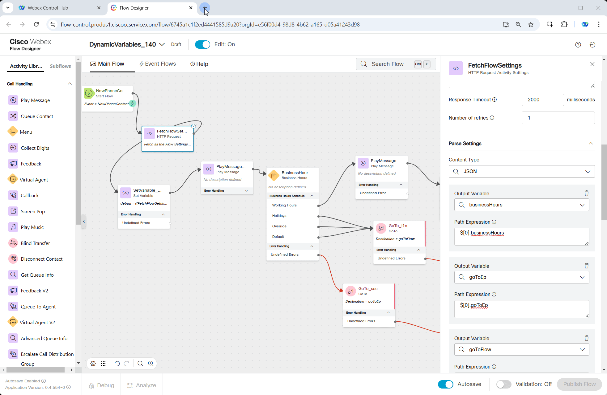

## Welcome Final Boss Fight Mission!

## Story
In this short troubleshooting task you're are going to play a technical engineer who got a request from end customer regarding broken production flow. You as an engineer must fix the reported issue before contact center opens in just 20 mins.  
So **NO PRESSURE HERE AT ALL!!!**

## Problem Description** 
A customer reports a critical issue with their call flow: callers cannot land in the queue and are being redirected indefinitely. Initially, the problem seemed to be related to the queue configuration, but after the customer attempted some adjustments, the situation worsened. Now, callers cannot even reach the queue node, and it seems like they are stuck in a loop.

## Mission Details: 
Your task is to identify and fix the issues causing this behavior. Specifically:

1. Eliminate the loop so that calls can progress through the flow correctly.
2. Ensure that calls land in Queue_140 as intended. Customer requirement is to us dynamic variable instead of static queue name.
3. Configure the "Play Message" node to inform callers they are waiting in Queue_140 while in the queue .

## Before you start:

1. Assign **FinalBoss_Flow_Your_Attendee_ID** to your **Your_Attendee_ID_Channel**.

2. Open the **FinalBoss_Flow_Your_Attendee_ID** and you're ready to start troubleshooting.

> 

**Hints**

> 
> 1. Use Debug and Analyzer tools to find out the place and cause of the loop.
>
> 2. To find out Test your API resource. **https://674481b1b4e2e04abea27c6e.mockapi.io/flowdesigner/Lab/DynVars?dn=*{DNIS}***
> 
>> - Replace {DNIS} with the provided DNIS number stripping +1
>> 
>> - [Example:] If your number **+14694096861**, then your GET Query should be ***https://674481b1b4e2e04abea27c6e.mockapi.io/lowdesigner/Lab/DynVars?dn=4694096861***
>>
>> - Open Chrome browser and past your URL. You should get the follwoing result
>> 
>> 
>> 
>> - Test JSON Path in the following tool [https://jsonpath.com/](https://jsonpath.com/){:target="_blank"}
>> 
>> - Paste your GET URL into the Browser address line and copy the output in square brackets (including brackets)
>>
>> - Open [https://jsonpath.com/](https://jsonpath.com/){:target="_blank"} and paste the copied response into **Inputs** window
>>
>> - In **JSONPath** box copy and paste one of the path expression from **FetchFlowSettings** to verify your results.
>>
>> 
> 

## Troubleshooting flow

<script src='../template_assets/load.js'><script>