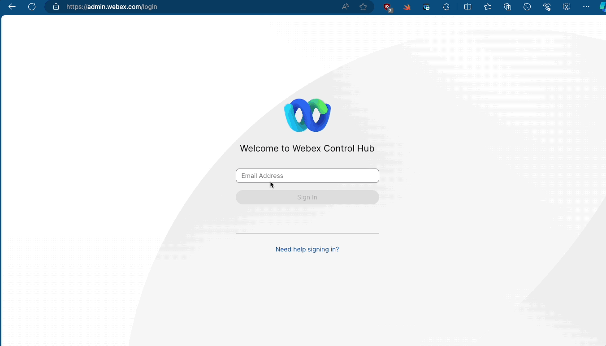
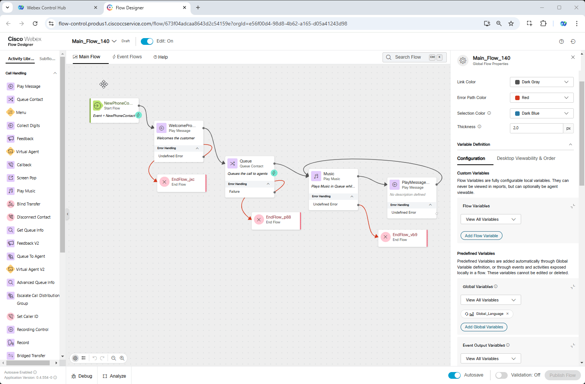

Your Attendee ID is: Loading...
Please ensure your ID is correct for event access.

!!! Note
    The input in the images that follow are only examples. They do not reflect the input you need to use in the lab exercises. In some cases, the input in the images may not follow the same attendee or pod ID from previous images. They are for representation only

## Enhancing the caller experience: The foundation of call routing techniques
Imagine calling a contact center, seeking quick, personalized help. Behind the scenes, a flow smoothly routes your call based on your needs.

In this lab, you’ll configure key flow elements for efficient caller journeys. Explore Flow Templates, set up routing with conditions like language preference, and use subflows to simplify processes. By the end, you'll be ready to design flows for real-world scenarios.

## Why Flow Templates?
Flow Templates in Webex Contact Center are an essential feature for flow developers, offering a range of benefits that streamline the development process and enhance the efficiency and consistency of flow creation. Here’s what they bring to the table:

  - **Consistency and Standards**: Templates ensure that flows adhere to best practices, creating consistent experiences across multiple projects.

  - **Time Savings**: Pre-built structures reduce the need to start from scratch, enabling faster setup and allowing more focus on customization.

  - **Reduced Errors**: Using tested templates lowers the risk of mistakes and minimizes troubleshooting.

  - **Easy Onboarding**: New developers or partners can learn quickly by using templates as guides.

  - **Scalability**: Templates allow developers to replicate and adapt solutions efficiently across different flows or deployments.

  - **Innovation**: Developers can spend more time on unique features and integrations rather than reconfiguring basics.

Flow Templates are designed to empower developers, speed up the development lifecycle, and maintain high-quality standards across flows, making them a core asset in Webex Contact Center flow design.

---

### Build

1. Login into [Webex Control Hub](https://admin.webex.com){:target="_blank"} by using your Admin profile. 
   Your login will be of the format **wxcclabs+admin_IDAttendeeID@gmail.com**. You will see another login screen with OKTA on it where you may need to enter the email address again and the password provided to you.

Your Attendee ID is: Loading...
Please ensure your ID is correct for event access.

    

    !!! Note 
        Remember to take up the offer from Chrome to save your password

3. This is the **Administration interface** for webex contact center and is also known as the Control Hub. Look for the contact center option in the left pane under **SERVICES – Contact Center** and click it
4. Navigate to **Flows**, click on **Manage Flows** dropdown list and select **Create Flows**
5. New Tab will be opened. Navigate to **Flow Templates**
6. Choose ***Simple Inbound Call to Queue template*** and click **Next**. You can open View Details and to see observe flow structure and read flow description
7. Name you flow as **Main_Flow_AttendeeID**. Then click on Create Flow

    

8. In the flow change **Edit** toggle from **OFF** to **ON**. Select **Play Message** node with label **WelcomePrompt** and on the Node settings modify **Text-to-Speech Message** to any greetings you like. This message will be the first message you hear while calling to your script.

9. Select **Queue** node. On the **General settings** keep Static Queue checked and select queue **AttendeeID_Queue** from the drop down list
    
    !!! Note
        As mentioned in **Getting Started**, all queues have been pre-configured so you don't need to change them at current step.

10. [Optional] Select **Play Message** node and on the **Node settings** modify **Text-to-Speech Message** to any message you like. This message will be played while the caller is waiting in the queue.

11. On bottom right corner toggle **Validation** from **Off** to **On** to check for any potential flow errors and recommendations. 

    !!! Note
        You can ignore recommendations but cannot skip errors.

12. Click **Publish** Flow
  
    

13. In Popped up window click on dropdown menu to select **Latest** label, then click **Publish**
14. Assign the Flow to your **Channel (Entry Point)** - Do this by first going to **Channel**, search for your channel **AttendeeID_Channel**.
15. Click on **AttendeeID_Channel**
16. In **Entry Point** Settings section change the following:

    > Routing Flow: **Main_Flow_AttendeeID**

    > Version Label: **Latest**

--- 

### Testing

1. Open [Agent Desktop](https://desktop.wxcc-us1.cisco.com/){:target="_blank"} and login with agent credentials you have been provided **wxcclabs+agent_IDAttendeeID@gmail.com**. You will see another login screen with OKTA on it where you may need to enter the email address again and the password provided to you. 
2. Select **Desktop** as a **Telephony Option** and Team **AttendeeID_Team**. Click **Submit**. Allow browser to access Microphone by clicking **Allow** on ever visit.
3. Make your agent **Available** and you're ready to make a call.

    

4. Open your Webex App and dial the Support Number provided to you, which is configured in your **AttendeeID_Channel** configuration.

   

### Summary
This lab may feel straightforward for some, which is understandable; however, it is essential for those encountering this material for the first time. As we progress, we will delve deeper into complex configurations, enabling you to create highly advanced flows.

---

---

## Enhance Your Flow by adding Language

**Step Objective:**
  - We are going to use same flow we created in previous section

  - Change TTS section to use en-AU

    ○ All supported languages can be found here: [Text-to-Speech-(TTS)-in-Webex-Contact-Center](https://help.webex.com/en-us/article/ntkjqhw/Text-to-Speech-(TTS)-in-Webex-Contact-Center){:target="_blank"} 

    ○ Place a call to verify/validate the speech

### Build

1. Open your flow **Main_Flow_AttendeeID** and change the mode from **Read-only** to **Edit-on** mode
2. Add a **Global Variable** named **Global_Language**

    

3. Add a **SetVariable** node with variable **Global_Language** that was added to the flow from the previous step. Add **Set Value** as ***en-AU*** which is English (Australia)
4. Validate the flow by clicking **Validate**, **Publish** and select the **Latest** version of the flow

    

5. Make a test call from Webex App by calling the Support Number, which is configured in your **AttendeeID_Channel** configuration.
Verify if the TTS language changed

**Congratulations on completing another mission.**
