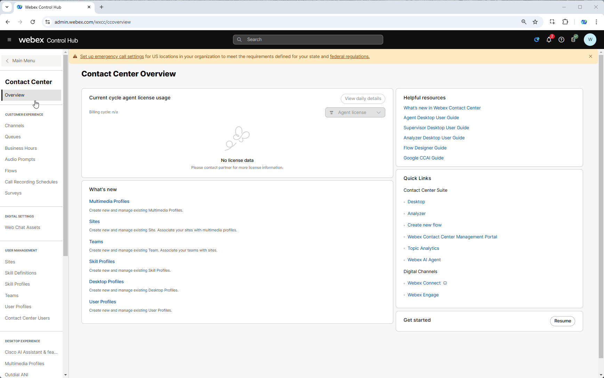
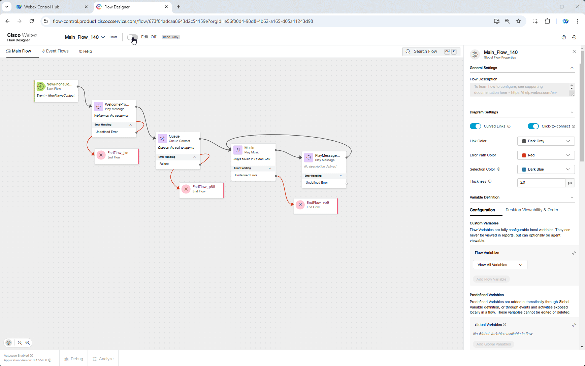

!!! Note
    The input in the images that follow are only examples. They do not reflect the input you need to use in the lab exercises. In some cases, the input in the images may not follow the same attendee or pod ID from previous images. They are for representation only

## Story
Imagine calling a contact center, seeking quick, personalized help. Behind the scenes, a flow smoothly routes your call based on your needs.

### Mission Details

Your mission is to:
  1. Configure key flow elements for efficient caller journeys.  
  2. Explore Flow Templates to streamline flow creation.  
  3. Set up routing with conditions, such as language preference.  
  4. Gain the skills to design flows for real-world scenarios.  

 **

Why Flow Templates? [Optional]
**
 Flow Templates in Webex Contact Center are an essential feature for flow developers, offering a range of benefits that streamline the development process and enhance the efficiency and consistency of flow creation. Here’s what they bring to the table:

  - **Consistency and Standards**: Templates ensure that flows adhere to best practices, creating consistent experiences across multiple projects.

  - **Time Savings**: Pre-built structures reduce the need to start from scratch, enabling faster setup and allowing more focus on customization.

  - **Reduced Errors**: Using tested templates lowers the risk of mistakes and minimizes troubleshooting.

  - **Easy Onboarding**: New developers or partners can learn quickly by using templates as guides.

  - **Scalability**: Templates allow developers to replicate and adapt solutions efficiently across different flows or deployments.

  - **Innovation**: Developers can spend more time on unique features and integrations rather than reconfiguring basics.

Flow Templates are designed to empower developers, speed up the development lifecycle, and maintain high-quality standards across flows, making them a core asset in Webex Contact Center flow design.

---

### Build

1. Login into [Webex Control Hub](https://admin.webex.com){:target="_blank"} by using your Admin profile. 
   Your login will be of the format **wxcclabs+admin_IDYour_Attendee_ID@gmail.com**. You will see another login screen with OKTA on it where you may need to enter the email address again and the password provided to you.

    

    !!! Note 
        Remember to take up the offer from Chrome to save your password

2. This is the **Administration interface** for webex contact center and is also known as the Control Hub. Look for the contact center option in the left pane under **SERVICES – Contact Center** and click it
3. Navigate to **Flows**, click on **Manage Flows** dropdown list and select **Create Flows**
4. New Tab will be opened. Navigate to **Flow Templates**
5. Choose **Simple Inbound Call to Queue** template and click **Next**. You can open View Details and to see observe flow structure and read flow description
6. Name your flow as **Main_Flow_Your_Attendee_ID**. Then click on Create Flow

    

7. **Edit** should be set to **ON** when you create new flow, but if not switch it from **OFF** to **ON**. Select **Play Message** node with label **WelcomePrompt** and on the Node settings modify **Text-to-Speech Message** to any greetings you like. This message will be the first message you hear while calling to your script.

8. Select **Queue** node. On the **General settings** keep Static Queue checked and select queue **Your_Attendee_ID_Queue** from the drop down list
    
    !!! Note
        As mentioned in **Getting Started**, all queues have been pre-configured so you don't need to change them at current step.

9. [Optional] Select **Play Message** node (the one which goes after Queue and Play Music nodes) and on the **Node settings** modify **Text-to-Speech Message** to any message you like. This message will be played while the caller is waiting in the queue.

10. On bottom right corner toggle **Validation** from **Off** to **On** to check for any potential flow errors and recommendations. 

    !!! Note
        You can ignore recommendations but cannot skip errors.

11. Click **Publish** Flow
  
    

12. In popped-up window, click on dropdown menu to select **Latest** label, then click **Publish**.

13. Return back to Control Hub to assign the Flow to your **Channel (Entry Point)** - Go to **Channels**, search for your channel **Your_Attendee_ID_Channel**.
14. Click on **Your_Attendee_ID_Channel**
15. In **Entry Point** settings section change the following, then click **Save** button:

    > Routing Flow: **Main_Flow_Your_Attendee_ID**

    > Version Label: **Latest**

--- 

### Checkpoint Test

1. Launch Webex CC Desktop application  and login with agent credentials you have been provided **wxcclabs+agent_IDYour_Attendee_ID@gmail.com**. You will see another login screen with OKTA on it where you may need to enter the email address again and the password provided to you. 
2. Select your Team **Your_Attendee_ID_Team**. Click **Submit**. Allow browser to access Microphone by clicking **Allow** on every visit.
3. Make your agent **Available** and you're ready to make a call.

    !!! Note
        This is the only time during the lab when you need to log in to the Webex CC Desktop application. It has been configured to keep your agent logged into the application for the entire duration of the lab. If, for any reason, you are logged out manually or due to a network error, please log in again as explained above.

    

4. Open your Webex App and dial the Support Number provided to you, which is configured in your **Your_Attendee_ID_Channel** configuration.

   

---

## Enhance Your Flow by adding Language

### Mission Details

Your mission is to:

  - Use the same flow created in the previous section.
  - Modify the TTS section to use **en-AU** (English - Australia) and connect the Set Variable node as illustrated below.
  - Place a call to verify and validate the speech functionality.

 **

Text-to-Speech (TTS) in Webex Contact Center[Optional]
**
All supported languages can be found here: [Text-to-Speech-(TTS)-in-Webex-Contact-Center](https://help.webex.com/en-us/article/ntkjqhw/Text-to-Speech-(TTS)-in-Webex-Contact-Center){:target="_blank"} 

### Build

1. Open your flow **Main_Flow_Your_Attendee_ID** and change the mode from **Read-only** to **Edit-on** mode
2. Add a **Global Variable** named **Global_Language**

    

3. Add a **SetVariable** with following configuration. 

  > Delete connection between **NewPhoneContact** and **WelcomePrompt**
  >  
  > Connect **NewPhoneContact** to **SetVariable**
  > 
  > Connect **SetVariable** to **WelcomePrompt**
  > 
  > Variable: **Global_Language**
  > 
  > Set Value:  **en-AU**
  
4. Validate the flow by clicking **Validate**, **Publish** and select the **Latest** version of the flow

    

### Testing

1. Open your Webex Desktop and make your agent **Available** and you're ready to make a call.

4. Open your Webex App and dial the Support Number provided to you, which is configured in your **Your_Attendee_ID_Channel** configuration.

   

5. Verify if the TTS language changed

### Summary
This lab may feel straight forward for some, which is understandable; however, it is essential for those encountering this material for the first time. As we progress, we will delve deeper into complex configurations, enabling you to create highly advanced flows.

**Congratulations on completing another mission.**
