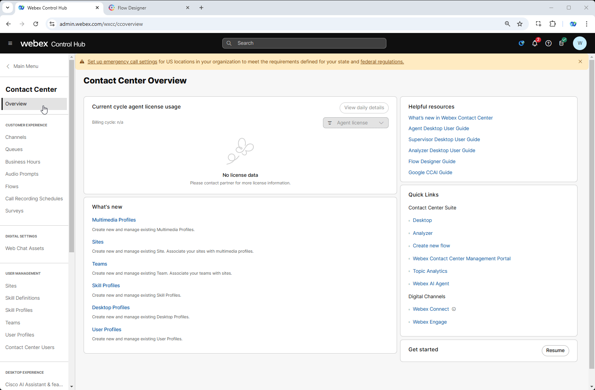

 Please **`submit the form below with your Attendee ID`**. All configuration entries in the lab guide will be renamed to include your Attendee ID.
{: .block-warning }

<form id="attendee-form">
  <label for="attendee">Attendee ID:</label>
  <input type="text" id="attendee" name="attendee" onChange="update()"> 
 
  <button onclick="update()">Save</button>
</form>

 

## Using Business Hours in Your Flow to add flexibility

Business Hours allows you to configure the operational hours of the contact center, offering an enhanced experience in routing strategy configuration and simplifying the routing flow for improved efficiency and customer satisfaction. 
Test 1:

  <w class="attendee_out">attendeeID</w>

Test 2:
**<w class = "attendee_out">attendeeID</w>_Bussiness_Hours**

Test 3:
attendeeID</w>@gmail.com">

### **Step Objective:**
  - We continue to use same flow we created in previous section

  - Business Hours entity **<w class = "attendee_out">attendeeID</w>_Bussiness_Hours** has been configured for you and contains the following settings:
    
    ○ **Working Hours** - Define time during which contact center will be operational. Each working hours contains one or more shifts. We can configure different schedules for different time zones
    
    ○ **Holidays** - Define specific day or day range which is declared is holiday. Entire 24 hours of the day selected is marked non-operational​.
    
    ○ **Overrides** - Configure working hours for special cases like Emergency or Christmas when contact center is working for additional hours​.

#### Build

1. Go and check your preconfigured Business Hours Entity. For that in **Control Hub** navigate to **Business Hours** under Customer Experience section

    

2. Open your flow **Main_Flow_<w class = "attendee_out">attendeeID</w>** and change the mode from Read-only to Edit-on mode
3. Drag and drop following nodes to the canvas:

    > - **Business Hours**
    >
    > - **Play Message**
    >
    > - **Disconnect Contact**

    

4. Connect **Business Hours** node exits as follow:

    > - **Working Hours** connect to **WelcomePrompt** node
    >
    > - **Holidays**, **Overrides** and **Default** connect to new added **PlayMessage** node.
    >
    > - New added **PlayMessage** connect to **Disconnect** contact

    

5. Click on **Business Hours** node and select preconfigured Business Hours Entity **<w class = "attendee_out">attendeeID</w>_Bussiness_Hours**.

6. Configure **PlayMessage** node as follows:

    > Enable Text-To-Speech
    >
    > Select the Connector: Cisco Cloud Text-to-Speech
    >
    > Click the Add Text-to-Speech Message button and paste text: ***It's not working hours currently. Please call later. Goodbye.***
    >
    > Delete the Selection for Audio File

7. Validate the flow by clicking **Validate**, **Publish** and select the Latest version of the flow
     
     !!! Note
        We haven't changed the flow behavior yet as Working hours covers the current time. You can make a call and accept it on agent desktop to verify.

    

   
8. We are going to use **Override** option to change the logic. Overrides as well as Business hours have been preconfigured for you. Now we need to apply it on your **<w class = "attendee_out">attendeeID</w>_Bussiness_Hours** entity. Open **<w class = "attendee_out">attendeeID</w>_Bussiness_Hours** in **Control Hub**, scroll down to **Additional Settings** and select **Overrides_Hours** from Override dropdown list. Then click **Save**.

    !!! Note
        Override Hours entity was configured to overwrite Working Hours and set to duration of current Cisco Live lab 

    

### Testing

1. Open your Webex App and dial the Support Number provided to you, which is configured in your **<w class = "attendee_out">attendeeID</w>_Channel** configuration. Make sure you hear the message we set in ***Step 6***.

### Post Testin steps

1. **[IMPORTANT]** Now we need to revert the configuration we made in ***Step 8*** as we are going to use same flow in upcoming tasks. Open **<w class = "attendee_out">attendeeID</w>_Bussiness_Hours** in **Control Hub**, scroll down to Additional Settings and select **None** from **Override** dropdown list. Then click **Save**.

      

11. Make one more call from Webex App to make sure you hear the original Welcome message you set on first steps of Main Mission of Fundamental Lab.

**Congratulations on completing another mission.**
