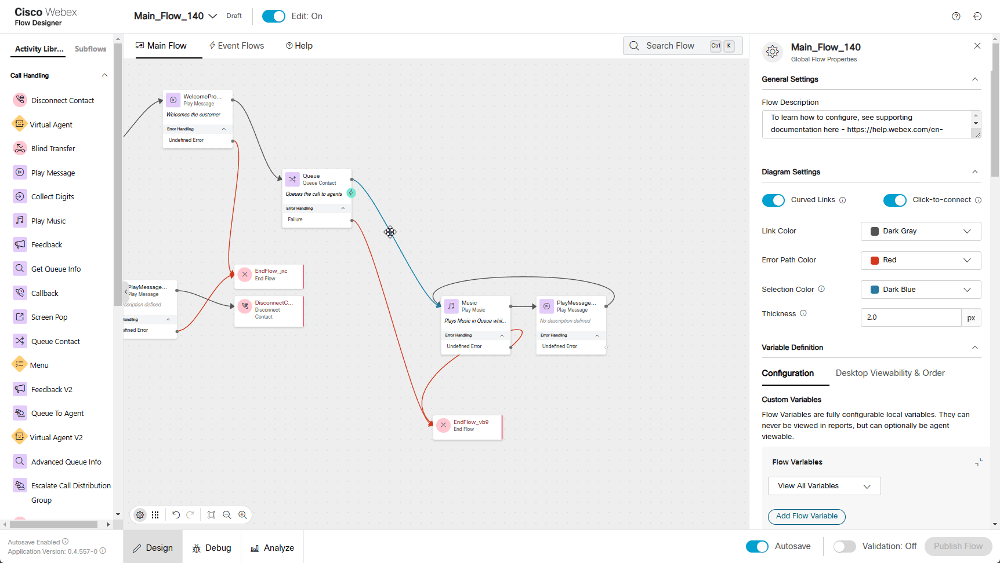
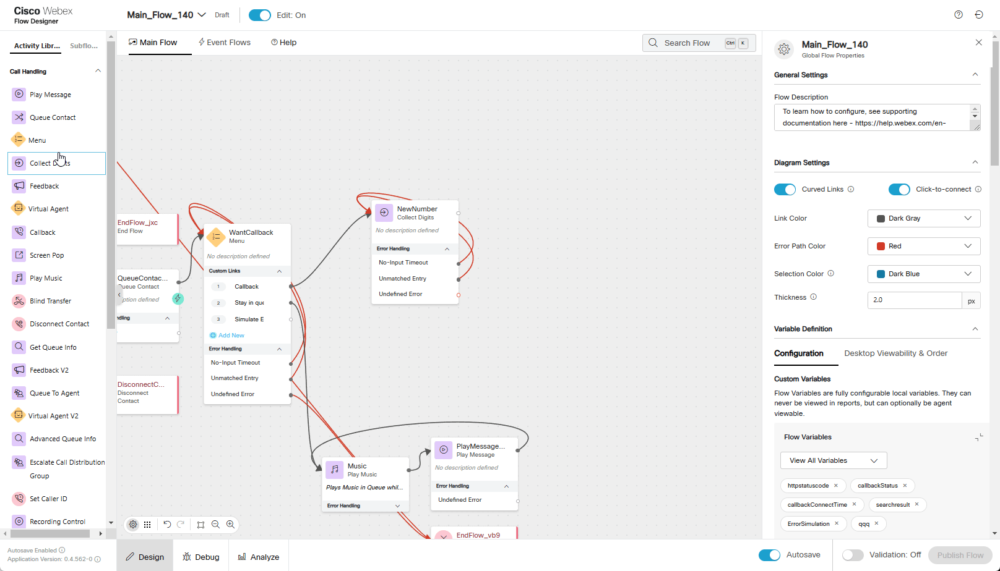
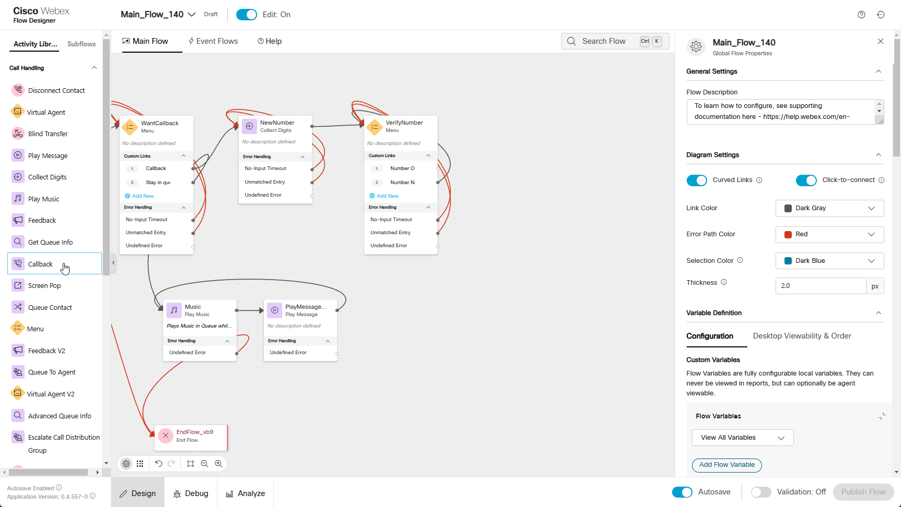

 Please **`submit the form below with your Attendee or pod ID`**. All configuration entries in the lab guide will be renamed to include your pod ID.
{: .block-warning }

<form id="attendee-form">
  <label for="attendee">Attendee ID:</label>
  <input type="text" id="attendee" name="attendee" onChange="update()"> 
 
  <button onclick="update()">Save</button>
</form>

 

### Story 

Callback functionality is an essential feature in a modern contact center, providing a solution that enhances both customer satisfaction and operational efficiency.

Imagine a customer calls a company’s sales line, interested in upgrading their service. The wait time is 20 minutes, but they’re in a busy store and can’t stay on hold. Instead, they request a callback.
Having a callback option is a must-have feature—it ensures businesses don’t lose potential leads while providing a seamless, customer-friendly experience.

### Build
We are going to extend the same flow by adding additional functionality so the caller would be offered with a callback later.

1. Open your flow **Main_Flow_<w class = "attendee_out">attendeeID</w>** and chanfe Edit mode to **On**
2. Delete  connection from **Queue** node to **Music** 
3. Drag **Menu** node:

    > Rename Activity Label to **WantCallback**
    >
    > Enable Text-To-Speech
    >
    > Select the Connector: Cisco Cloud Text-to-Speech
    >
    > Click the Add Text-to-Speech Message button and paste text: ***All agents are busy. Please press 1 if you want to schedule a callback. Press 2 if you want to wait in queue.***
    >
    > Delete the Selection for Audio File
    >
    > Under Custom Menu Links:
    >>
    >> Change first Digit Number 0 to 1, add Link Description as **Callback** 
    >>
    >> Add New Digit Number as 2 with Link Description **Stay in queue**

    

4. Drag Collect Digits nodes
    Menu node:

    > Rename Activity Label to **NewNumber**
    >
    > Enable Text-To-Speech
    >
    > Select the Connector: Cisco Cloud Text-to-Speech
    >
    > Click the Add Text-to-Speech Message button and paste text: **Please enter your 11 digits phone number to which we should call you back.**
    >
    > Delete the Selection for Audio File
    >   
    > Advanced Settings:
    >
    >> No-Input Timeout  5 
    >>
    >> Make Prompt Interruptible: True
    >>
    >> Minimum Digits: 11
    >>
    >> Maximum Digits: 11
    >       
    > Connect **No-Input Timeout** to the front of the **NewNumber** node
    >
    > Connect Unmatched Entry to the front of the NewNumber node
    >   
    > Connect **Callback** from **WantCallback** node created in step 3 to **NewNumber** node
    >
    > Connect **Stay in queue** from **WantCallback** node created in step 3 to **Music** node

    

5. Drag one more Menu node
    
    > Rename Activity Label to **VerifyNumber**
    >
    > Enable Text-To-Speech
    >
    > Select the Connector: Cisco Cloud Text-to-Speech
    >
    > Click the Add Text-to-Speech Message button and paste text: **You entered** *{{NewNumber.DigitsEntered}}***. Press 1 if the number is correct. Press 2 if you want to re-enter the number.**
    >
    > Delete the Selection for Audio File
    >
    >    
    > Custom Menu Links:
    >>
    >> Change first Digit Number from 0 to 1, add Link Description as **Number OK**
    >>
    >> Add New Digit Number as 2 with  Link Description **Number Not OK**
    >
    > Connect **No-Input Timeout** to the front of the **VerifyNumber** node
    >
    > Connect **Unmatched Entry** to the front of the **VerifyNumber** node
    >    
    > Connect **NewNumber** created in step 4 to **VerifyNumber** node
    >
    > Connect **Number Not OK** from **VerifyNumber** node created in step 5 to **VerifyNumber** node
    
    

6. Add **Callback** node
    
    > Callback Dial Number select5  ***NewNumber.DigitsEntered*** from dropdown list
    >    
    > Connect **Number OK** from **VerifyNumber** node created in step 5 to **CallBack** node

7. Add **PlayMessage** node as follows:
    
    > Enable Text-To-Speech
    >
    > Select the Connector: Cisco Cloud Text-to-Speech
    >
    > Click the Add Text-to-Speech Message button and paste text: You call has been successfully scheduled for a callback. Good Bye.
    >
    > Delete the Selection for Audio File
    >
    > Connect **CallBack** created in step 6 to **PlayMessage** node
    > Connect **PlayMessage** created in step 6 to **DisconnectCall** node
    
    

8. Validate the flow by clicking **Validate**, **Publish** and select the Latest version of the flow

    
###Testing
    
1. Make sure you re logged in as Agent and set status to **Not Available**. In this case call will not be assigned to an agent and callback will be proposed to a caller.
2. Make a call to your test number and if success you should hear configured messages and ask to provide a new number for a callback. Because in current lab we are having number limitations we are going to provide a wellknown Cisco Worldwide Support contact number **1 408 526 7209**
3. Once done another message about successful scheduling should play.
4. Make your agent **Available**. Contact Center will reserve you right away and propose to answer a callback call.

**Congratulations on completing another mission.**
