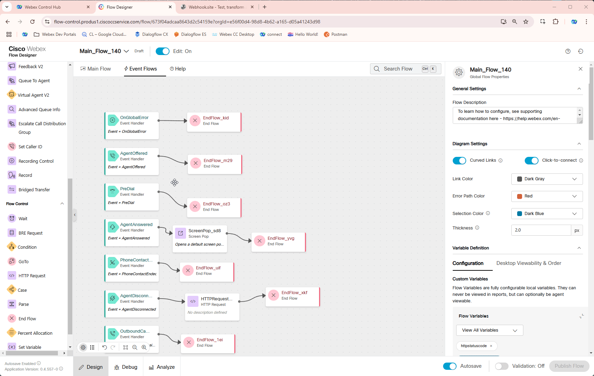
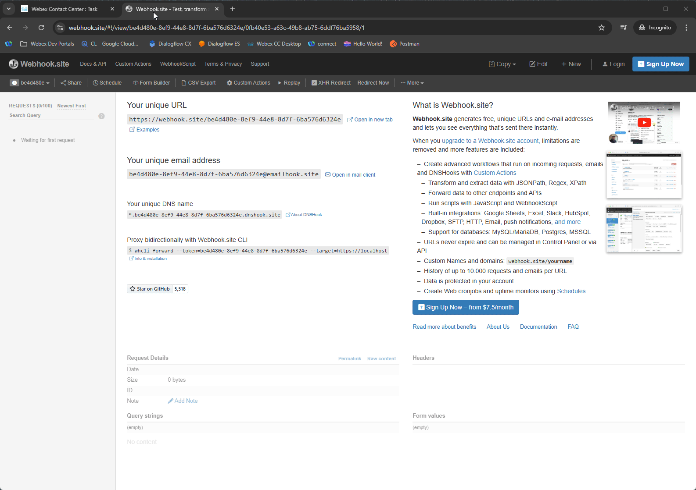

<script>
 function update () {
    const form = document.forms['attendee-form'];
    if (form) {
      form.addEventListener('submit', function (event) {
        event.preventDefault();
        const inputs = Array.from(form.querySelectorAll('input'));
        const values = inputs.reduce((acc, input) => {
          acc[input.id + '_out'] = input.value;
          return acc;
        }, {});

        Object.entries(values).forEach(([id, value]) => {
          const elements = document.getElementsByClassName(id);
          Array.from(elements).forEach(element => {

            console.log(element.innerHTML);
            if(Number(element.innerHTML) > 99 ){
               console.log(`Got a 99+ attendee: ${element.innerHTML}`);
               element.innerHTML = value;
             }
            else{
               console.log(`Got a sub 99 attendee: ${element.innerHTML}`);
               if(element.innerHTML.includes('gmail.com'))
               {
                element.innerHTML = `0${value}`;
                }
               else{
                element.innerHTML = value;
               }
                }
          });
        });
        const attendeeIDInput = form.elements['attendeeID'];
       if (attendeeIDInput && attendeeIDInput.value !== 'Your_Attendee_ID') {
          localStorage.setItem('attendeeID', attendeeIDInput.value);
        }
      });
    }
  };
</script>
<style>
  /* Style for the button */
  button {
    background-color: black; /* Set the background color to black */
    color: white; /* Set the text color to white */
    border: none; /* Remove the border */
    padding: 10px 20px; /* Add some padding for better appearance */
    cursor: pointer; /* Show a pointer cursor on hover */
  }

   /* Style for the input element */
  input[type="text"] {
    border: 2px solid black; /* Set the border thickness to 2px */
    padding: 5px; /* Add some padding for better appearance */

</style>


 Please **`submit the form below with your Attendee or pod ID`**. All configuration entries in the lab guide will be renamed to include your pod ID.
{: .block-warning }

<script>
document.forms["attendee-form"][1].value = localStorage.getItem("attendeeID") || "Your Attendee ID" 
</script>
<form id="attendee-form">
  <label for="attendee">Attendee ID:</label>
  <input type="text" id="attendee" name="attendee" onChange="update()"><br>
<br>
  <button onclick="update()">Save</button>
</form>

<br/>

### What is an Event Flow?

An Event Flow in Webex Contact Center is a workflow triggered by specific events in the customer interaction process, such as call arrival, agent assignment, call disconnection or actions within the IVR.

Event flows enable a wide range of scenarios, with one common use case being the ability to update an external database with data collected during a call—either from the IVR or through interaction with a live agent.

In this mission, we’ll use **[Webhook.site](https://webhook.site/){:target="_blank"}**, a tool that acts as a temporary mailbox for online notifications, to capture and test data sent via webhooks. We’ll send a simple **POST** request containing call data and information provided by the agent during the call.

### Configuration

1. Create a **Global Variable** by accessing Flows -> Global Variable tab
    
    > Name: **WhoIsCalling**
    >
    > Variable Type: String
    >
    > Make agent viewable: Yes
    >
    > Desktop label: Who Is Calling?
    >
    > Edit on Desktop: Yes
        
        
2. Open you your **Main_Flow_<w class = "attendee_out">attendeeID</w>** or refresh the Flow Designer page to make sure new created Global Variables are being populated. Add **WhoIsCalling** Global Variable to the flow.
    
    
    

3. Open New Browser tab and paste the following URL **[Webhook.site](https://webhook.site/){:target="_blank"}**. Then click on **Your unique URL** to make a copy of URL. **<span style="color: red;">DO NOT Close this Tab</span>**

    
    
4. Go back to your flow, remove connection between AgentDisconnect and EndFlow_xkf and add HTTP node in between these nodes.
      
    > Use Authenticated Endpoint: Off
    >
    > Request URL: Paste your unique URL copied on step 3 from **https://webhook.site/**.
    >
    > Method: **POST**
    >
    > Content Type: **Application/JSON**
    >
    > Request Body:  
    ```JSON
    {
    "DNIS":"{{NewPhoneContact.DNIS}}",
    "ANI":"{{NewPhoneContact.ANI}}",
    "InteractionId":"{{NewPhoneContact.InteractionId}}",
    "Language":"{{Global_Language}}",
    "WhoCalls":"{{WhoIsCalling}}"
    }
    ```

    !!! Note
        We are building a dictionary with values generated by flow, language we set in main lab and also WhoIsCalling value which will be provided by agent in agent desktop.
    
    
    
5. <span style="color: orange;">[Optional]</span>: You can also modify **Screenpop** configuration in the same flow
    > URL Settings: **[https://www.ciscolive.com/emea/faqs.html](https://www.ciscolive.com/emea/faqs.html){:target="_blank"}**
    > Screen Pop Desktop Label: **Cisco Live Amsterdam 2025 FAQ**
    > Display Settings: New browser Tab.
  
   
    
7. Validate the flow by clicking **Validate**, **Publish** and select the Latest version of the flow
    
### Testing
    
1. Make sure you're logged in as Agent **wxcclabs+admin_ID<w class = "attendee_out">attendeeID</w>@gmail.com** and set status to Available.
2. Make a call to your test number and if success you should hear Welcome message and then accept the call by agent.
3. In agent interaction panel change  Who Is Calling? to any text you like then click Save and End the call.
4. On **[Webhook.site](https://webhook.site/){:target="_blank"}** you should see the request which came right after Agent dropped the call with all the needed data 



**Congratulations on Completing Mission 2 of Lab A where you have learnt how to use events in your flows.**
