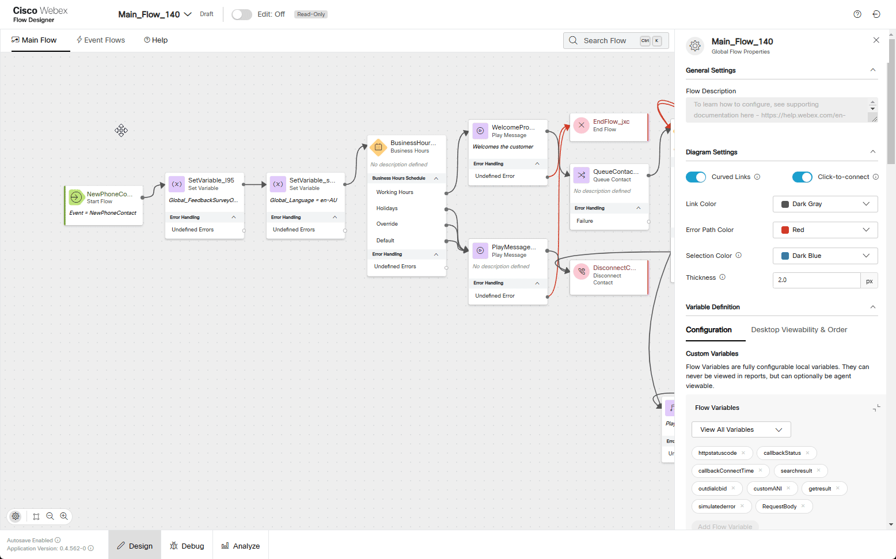
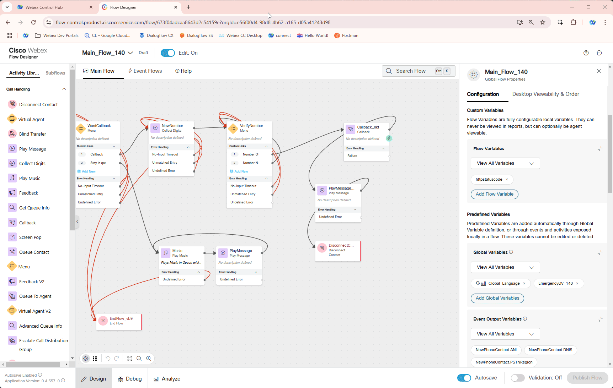
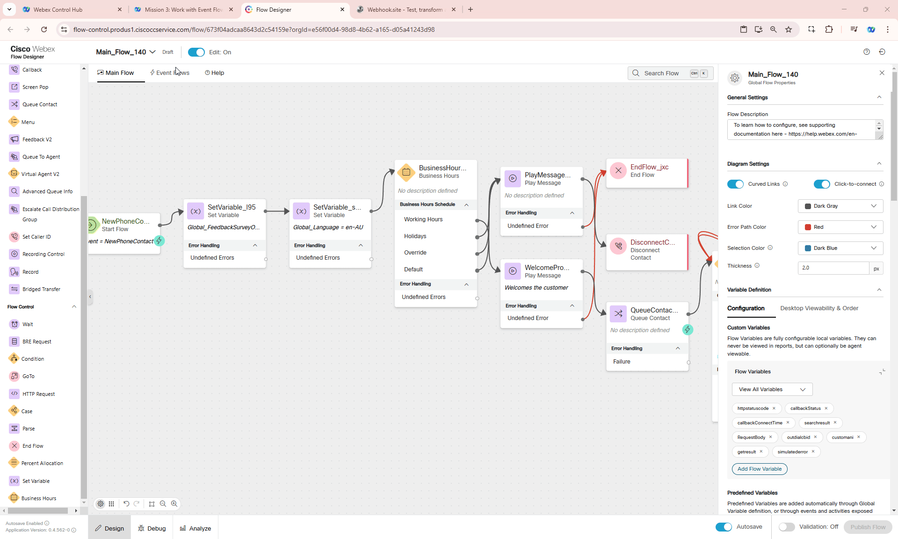

### What is an Event Flow?

An Event Flow in Webex Contact Center is a workflow triggered by specific events in the customer interaction process, such as call arrival, agent assignment, call disconnection or actions within the IVR.

Event flows enable a wide range of scenarios, with one common use case being the ability to update an external database with data collected during a call—either from the IVR or through interaction with a live agent.

In this mission, we’ll use **[Webhook.site](https://webhook.site/){:target="_blank"}**, a tool that acts as a temporary mailbox for online notifications, to capture and test data sent via webhooks. We’ll send a simple **POST** request containing call data and information provided by the agent during the call.

### Configuration

!!! Note:
     The **Global Variable** with name **WhoIsCalling** that we are going to use in this mission has been already created. Switch to **Control Hub** and navigate to **Flows** under Customer Experience section. Select Global Variables on top and search for **WhoIsCalling** to observe it's configuration. You <span style="color: orange;">**DO NOT**</span> need to modify it here.
             
1. Open you your **Main_Flow_<span class="attendee-id-placeholder">Your_Attendee_ID</span>** or refresh the Flow Designer page to make sure new created Global Variables are being populated. Add <span class="copy-static" title="Click to copy!" data-copy-text="WhoIsCalling"><span class="copy"></span></span> Global Variable to the flow.
    
    
    

2. Open New Browser tab and paste the following URL **[Webhook.site](https://webhook.site/){:target="_blank"}**. Then click on **Your unique URL** to make a copy of URL. 
**<span style="color: red;">DO NOT Close this Tab</span>**

    
    
3. Go back to your flow and navigate to Even Flow tab, remove connection between **AgentDisconnect** and **EndFlow_xkf** and add **HTTP Request** node in between these nodes.
      
    > Use Authenticated Endpoint: **Off**
    >
    > Request URL: *<span style="color: red;">Paste your unique URL copied on Step 3 from https://webhook.site/</span>*.
    >
    > Method: **POST**
    >
    > Content Type: **Application/JSON**
    >
    > Request Body:  
    ```JSON
    {
    "DNIS": "{{NewPhoneContact.DNIS}}",
    "ANI": "{{NewPhoneContact.ANI}}",
    "InteractionId": "{{NewPhoneContact.InteractionId}}",
    "Language": "{{Global_Language}}",
    "WhoCalls": "{{WhoIsCalling}}"
    }
    ```

    !!! Note
        We are building a dictionary with values generated by flow, language we set in main lab and also WhoIsCalling value which will be provided by agent in agent desktop.
    
    
    
6. <span style="color: orange;">[Optional]</span>: You can also modify **Screenpop** configuration in the same flow

    > URL Settings: **[https://www.ciscolive.com/emea/faqs.html](https://www.ciscolive.com/emea/faqs.html){:target="_blank"}**<span class="copy-static" title="Click to copy!" data-copy-text="[Cisco Live Amsterdam 2025 FAQ](https://www.ciscolive.com/emea/faqs.html)"><span class="copy"></span></span>
    >
    > Screen Pop Desktop Label: **Cisco Live Amsterdam 2025 FAQ**<span class="copy-static" title="Click to copy!" data-copy-text="Cisco Live Amsterdam 2025 FAQ"><span class="copy"></span></span>
    >
    > Display Settings: New browser Tab.
  
    
    
7. Validate the flow by clicking **Validate**, **Publish** and select the Latest version of the flow
    
### Testing
    
1. Make sure you're logged into Webex CC Desktop application as Agent **wxcclabs+agent_ID<span class="attendee-id-placeholder">Your_Attendee_ID</span>@gmail.com** and set status to **Available**.
2. Make a call to the Support Number and if success you should hear Welcome message and then accept the call by agent.
3. In agent interaction panel change **Who Is Calling?** to any text you like then click **Save** and End the call.
4. On **[Webhook.site](https://webhook.site/){:target="_blank"}** you should see the request which came right after Agent dropped the call with all the needed data 


**Congratulations on completing another mission where you have learnt how to use events in your flows.**
