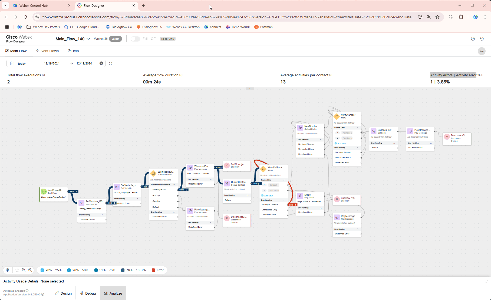
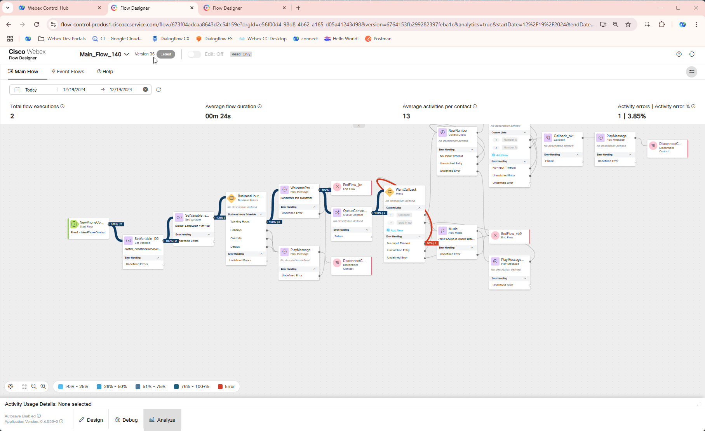

 Please **`submit the form below with your Attendee or pod ID`**. All configuration entries in the lab guide will be renamed to include your pod ID.
{: .block-warning }

<form id="attendee-form">
  <label for="attendee">Attendee ID:</label>
  <input type="text" id="attendee" name="attendee" onChange="update()"> 
 
  <button onclick="update()">Save</button>
</form>

 

!!! Note
    Current mission does not contain any configuration steps but focused on additional Flow Designer tools that facilitate flow troubleshooting and might give you ideas of how to optimize your flow logic.
---
## Debug Ovewrview

The Debug Tool is an essential feature in the Webex Contact Center Flow Designer, designed to simplify troubleshooting and enhance visibility into the call flow behavior. Its importance lies in its ability to provide real-time insights, enabling administrators and developers to quickly identify and resolve issues that could impact customer experience.

### Why Debug is Important

1. **Real-Time Analysis**: Tracks the call flow execution step by step, showing which nodes are executed and the data passed between them.

2. **Error Identification**: Quickly pinpoint errors, such as misconfigured nodes, incorrect variable usage, or unexpected call routing.

3. **Optimization**: Provides insights into flow performance, allowing you to optimize for efficiency and accuracy.

### How to Use the Debug Tool

1. Open your **Main_Flow_<w class = "attendee_out">attendeeID</w>** in Flow Designer and navigate to the Debug Tool.

2. So far we have already made couple of calls so you can select latest by clicking on any interaction.

  !!! Note
      - You can search your call by Intercation ID
      - Filter by Date Range and by Label

3. Observe the execution path, with visual indicators highlighting the flow nodes being executed.
4. By clicking on each activity name you will see it's details. ***Examples: Entry point ID, Flow Label, DNIS, selected Business Hours, also TTS value and what events were triggered.***

    

5. Spend some time to explore the tool. Identify bottlenecks, loops, or errors if any. 
6. As an option, you can break something in your flow and see how Debug tool shows that error.

By leveraging the **Debug Tool** effectively, you can ensure your call flows function as intended, providing a seamless experience for both customers and agents.

---

## Flow Analytics Ovewrview

Flow Analytics feature is designed to provide flow developer, administrators and supervisors with a comprehensive, graphical view of how Flow paths are being utilized across all customer interactions. This feature will enable better analysis of IVR flow operations, helping to identify areas for improvement and increase self-service containment. The feature provides an aggregated view that allows users to:

  - Analyze traces aggregated over a period of time.
  - Visualize the aggregated data in a flow diagram, with various metrics like, average call duration, error percentage, along with some activities level metrics. 
  - Show interaction traces for a selected activity.
  - Switch between multiple versions of analytics views.
  - Color-coded links between activities based on the number of activity executions, and status.

### Why Flow Analytics Important

1. **Performance Monitoring**: Tracks key metrics, such as flow usage, execution frequency, and processing times, helping you assess flow efficiency.
2. **Behavior Analysis**: Identifies patterns in customer interactions and highlights potential issues, such as abandoned calls or potential loops.
3. **Proactive Optimization**: Offers data-driven insights to fine-tune flow configurations, ensuring optimal performance and alignment with business objectives.

### How to Use the Flow Analytics Tool

1. Open your **Main_Flow_<w class = "attendee_out">attendeeID</w>** in Flow Designer and navigate to the Flow Analytics Tool.

2. Specify a DateTime range for the report. All calls we made happened today hence select **Today** option.

3. Review visualizations and reports showing flow metrics, such as:
    
    - Total flow Executions
    
    - Execution paths and their frequency
    
    - Avarage flow duraion
    
    - Average activities per contact
    
    - Activity errors | Activity error %

    

4. Drill down into specific interactions by clicking on desired node.

5. If you spot any error, click on that node. In poped up **Activity Usage Details** window you can find call details: ***Interaction ID, Start and End time, Duration and cross-launch link to Debugger.***

    

6. Observe older flow version by selecting **Version History**. Then expand **Other Versions**. Chose anyone you like and click **View**. You might need to specify DateTime range again in case selected flow version was never executed withing selected range in **Step 2**.

    

By leveraging the Flow Analytics Tool, you gain a comprehensive understanding of how your flows perform and interact with customers, enabling you to make data-backed decisions to improve both efficiency and user satisfaction.
