## Story

The mission is designed to provide a hands-on understanding of creating Cisco Virtual Agents, covering key tasks such as creating a virtual agent using a template, integrating the bot with flow for voice calls, updating bot responses, adding new intents and entities, enhancing training data using generative AI, and leveraging bot transcripts and analytics for insights.

### Call Flow Overview

1. A new call enters the flow.
2. The AI Agent interacts with the caller by asking configured questions.
3. The AI Agent ends the conversation after collecting all the necessary details.

### Mission Details

This lab is designed to provide an in-depth understanding of the Webex AI Agents available in Webex Contact Center. By completing this section of the lab, you will:

- Gain practical skills and knowledge on how to effectively utilize Webex Contact Center's AI capabilities to create self-service automation.
- Improve the containment rate of your contact center, increasing efficiency and reducing costs.
- Learn how to create an effective AI Voice solution using Cisco's Webex Connect Bot builder platform and Webex Contact Center Flow Designer.
- Understand the use of Generative AI to fast-track bot development and save time.
- Troubleshoot AI Agent functionality to enhance performance.

### Build

#### Creating a AI Agent using a Template

1. Login into [Webex Control Hub](https://admin.webex.com){:target="_blank"} by using your Admin profile **wxcclabs+admin_IDYour_Attendee_ID@gmail.com**. You will see another login screen with OKTA on it where you may need to enter the email address again and the password provided to you.

2. Go to Contact Center from the left side navigation panel, and under Quick Links, click on **Webex AI Agent**

      

3. Click on **Create agent** to create a new bot. Select the **Appointment Booking** Template and click on **Next** button.
4. Agent Name **Your_Attendee_ID_TaskBot_CL2025** and click **Create**
5. Make the bot live by clicking on the **Make Live** button on the top right.
6. Enter **v1** in the popup modal which appears after clicking on **Make Live**.

    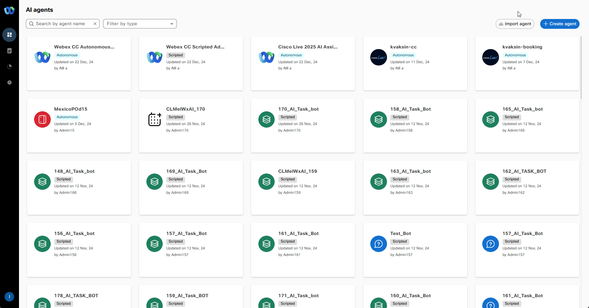  

7. Click on the **Preview** button on the top right side to test the bot. Try the bot flow by typing ***"I would like to cancel an appointment"***

    <!-- md:option type:note -->
    
    !!! note "Sample Conversation"
        **AI Agent**: Welcome to Cumulus Healthcare. How may I assist you today? 
        **You**: "I would like to cancel an appointment" 
        **AI Agent**: Please provide the patient's 6-digit insurance number. 
        **You**:"123456" 
        **AI Agent**: Please provide your 10-digit phone number. 
        **You**:"0123456789" 
        **AI Agent**: You have an appointment on 20/01/2025 at 15:00. Would you like to cancel it? 
        **You**:"yes" 
        **AI Agent**: Your appointment for 20/01/2025 at 15:00 is cancelled. 

    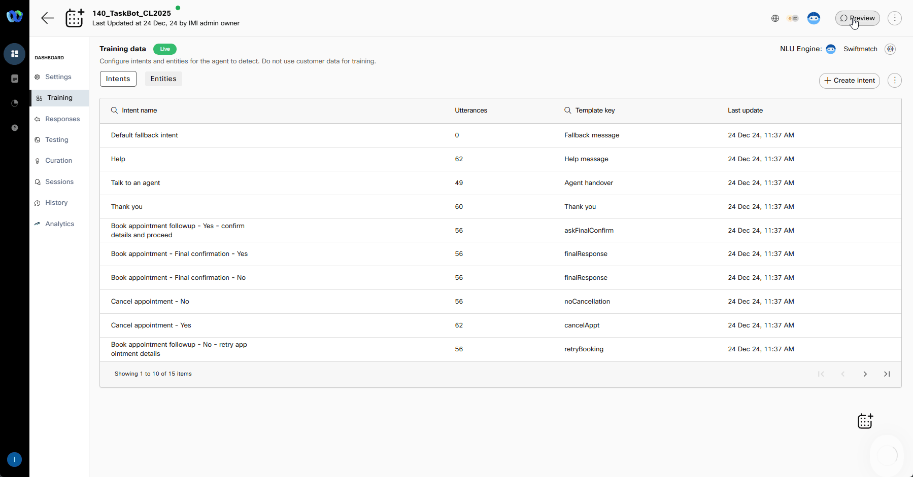  

---

#### Integrating the Bot with Flow for Voice Calls

1. In Control Hub navigate to **Flows**, click on **Manage Flows** dropdown list and select **Create Flows**

2. Select **Start Fresh** and name the new flow **TaskBot_Flow_Your_Attendee_ID**.

      

3. Make sure the **Edit** mode at the top is set to **ON**. Then, drag and drop the **Virtual Agent V2** and **DisconnectContact** activity from the left panel onto the canvas.

    !!! Note
        Please make sure to use **VirtualAgentV2** activity and **NOT** **VirtualAgent** also present on the Activity Library for Backward Compatability.

    > Connect the **New Phone Contact** output node edge to this **VirtualAgentV2** node
    >
    > Connect the Handled outputs to **DisconnectContact** 
    >
    > Connect the Escalated outputs to **DisconnectContact** 
    >
    > Connect the Errored outputs to **DisconnectContact** 
    >
    > Select **Static Contact Center AI Config**
    >
    > Contact Center AI Config: **Webex AI Agent (Scripted)**
    >
    > Virtual Agent: **Your_Attendee_ID_TaskBot_CL2025**

4. On bottom right corner toggle **Validation** from **Off** to **On**
5.  Click **Publish** Flow. In Popped up window click on dropdown menu to select **Latest** label, then click **Publish**

    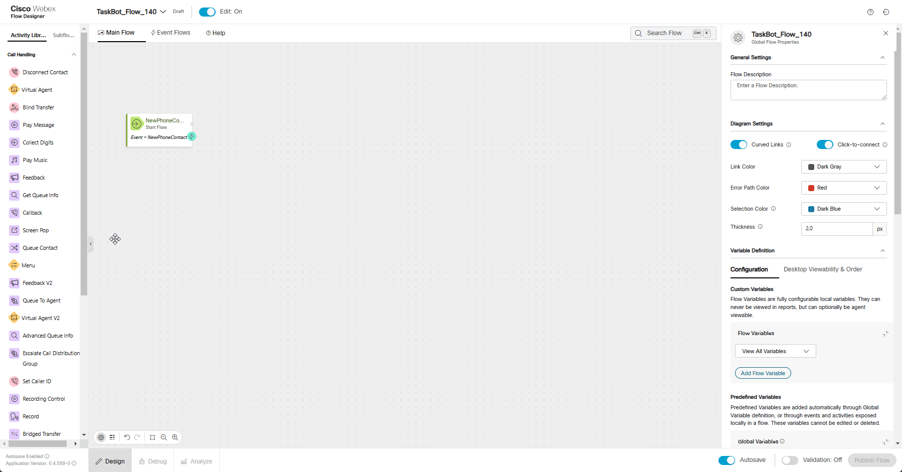  

6. Assign the Flow to your **Channel (Entry Point)** - Do this by first going to **Channel**, search for your channel **Your_Attendee_ID_Channel**.
7. Click on **Your_Attendee_ID_Channel**
8. In **Entry Point** Settings section change the following:

    > Routing Flow: **TaskBot_Flow_Your_Attendee_ID**

    > Version Label: **Latest**

    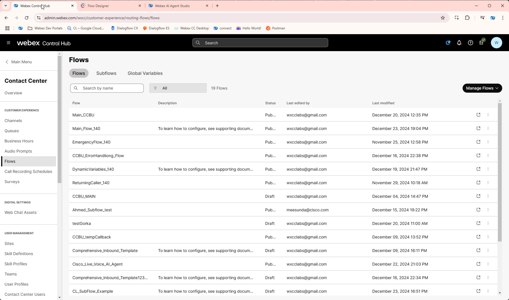  

9. Dial Support Number assigned to your **Your_Attendee_ID_Channel** to test the Virtual Agent over a voice call.

---

#### Updating Bot Responses

In this step, we will learn how to update bot responses and test these changes, both in preview mode and by making a live call. Testing in preview mode allows you to ensure the changes worked as expected, while making a live call confirms the bot's performance in a real-world scenario.

1. Login into [Webex Control Hub](https://admin.webex.com){:target="_blank"} by using your Admin profile **wxcclabs+admin_IDYour_Attendee_ID@gmail.com**. You will see another login screen with OKTA on it where you may need to enter the email address again and the password provided to you.

2. Go to Contact Center from the left side navigation panel, and under Quick Links, click on **Webex AI Agent**

      

3. Search and open your bot **Your_Attendee_ID_TaskBot_CL2025** that you created earlier. Then go to the **Responses** tab on the left-hand panel.
    
    >
    > Select the **Welcome message** in **Default message**
    >
    > Update the text to ***"Welcome to Cumulus Healthcare. How may I assist you today?"*** for the Default (web) channel.
    >
    > Navigate to the Voice Channel and update the text to ***"Welcome to Cumulus Healthcare. How may I assist you today?"***
    >
    > Click on the update button to confirm the changes. Make the bot live by clicking on the **Make Live** button

     

4. Click on **Preview** to test if the Greeting has been successfully updated.

    

---

#### Adding New Intents & Entities

In this step, we will learn how to add new intents and entities to enhance the bot's ability to understand and respond to a broader range of user inputs. These updates will be tested in both preview mode and during a live call to confirm that the bot correctly identifies the new intents and entities and provides appropriate responses.

1. To expedite the completion of this lab, it is recommended to remove all languages except the default language(English), and proceed with the lab. After disabling all the languages please make sure to hit on **Save changes** and you should see a green **Agent updated** message that confirms the action. 

    

2. Navigate to the Training Tab from the left-hand panel and click on the **Create Intent** button located in the top right corner.
3. Add a new intent by providing the intent name as ***ReferralRequest*** and include the following two utterances:

    - ***I would like a referral for a cardiologist.***
    - ***I need a referral to visit a neurologist.***

    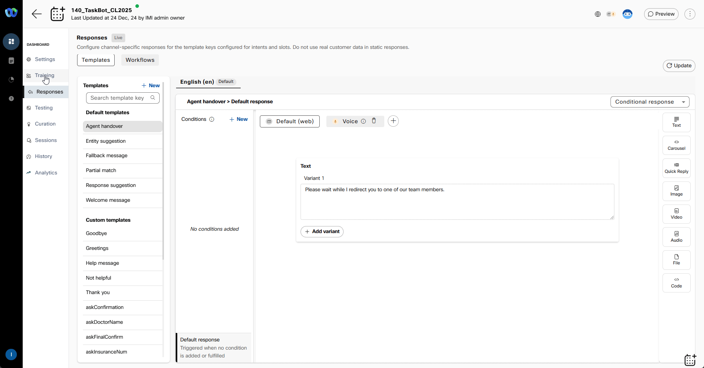 

4. Click on **Link entity** and add **patient phone number** as an entity.

    >
    > Check the **Required** checkbox 
    >
    > Select the template key as **askPhoneNumber**, which will be used to prompt the patient for their phone number.
    

5. Again, click on **Link Entity** and add **patient dob** (date of birth) 

    > 
    > Check **Required** checkbox
    > 
    > Select the template key as **askPatientDob**. When this intent is matched, it will trigger the Virtual Agent to ask the user to provide their phone number and date of birth for verification purposes.

      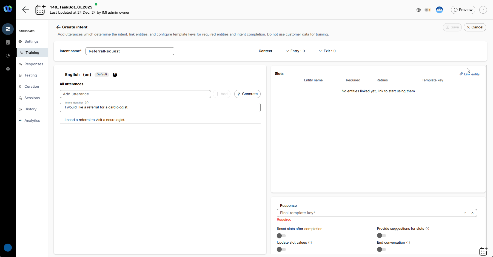 

6. On the same page at the bottom, click on Response drop-down list with **Final Template Key** and scroll down to **Create new**.

    > 
    > Template key: **ReferralResp**
    > 
    > Text Response (Optional): ***Your request has been logged and will be reviewed by our team. You will receive a callback once it's approved. Is there anything else I can assist you with?***
    >
    > Click **Create**

 7. Click on **Save**.

     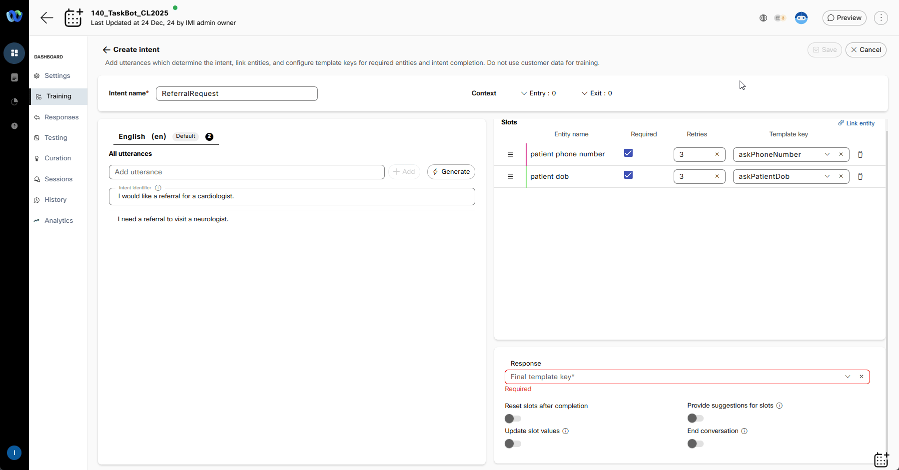 

8. Return to the Training tab and click on the **Train** button to update the bot's understanding with the new intent and entities.
9. Add a comment such as ***Added referral request intent*** to track the changes.
10. Click on **Make Live** to update the live version of the bot with these changes.
11. Provide a description for the update and choose **Make Live** or **Make Live both** if there are other unsaved changes pending.

    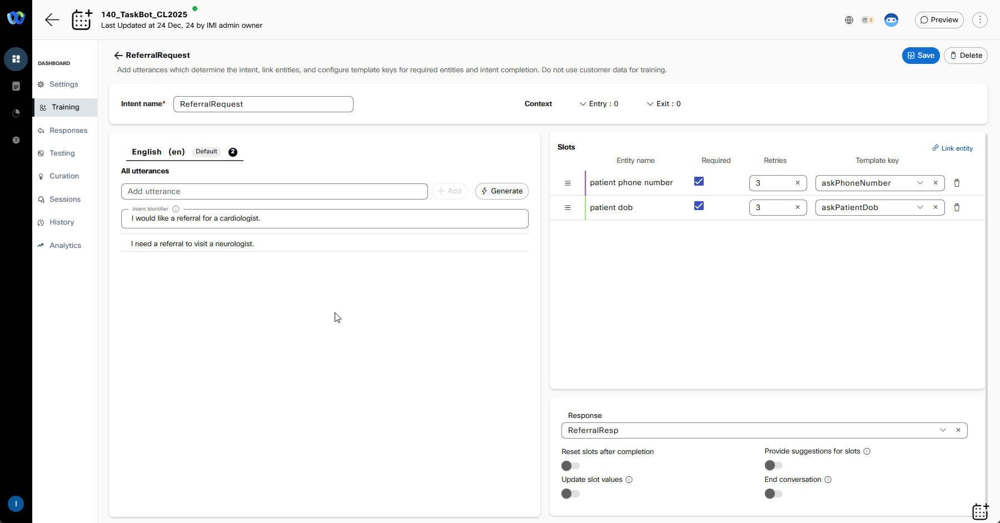 

12. Use the **Preview** feature to test the bot flow with the input query: ***I need a referral for a cardiologist***.
13. You can also test this interaction in voice mode by dialing the Supported Number assigned to your pod.

     

---

#### Adding Training Data using Generative AI

In this step, we will learn how to enhance the bot's capabilities by adding training data using generative AI and validate the changes by making a call.

1. Return to the **Referral Request** intent that you created in the previous exercise.

2. Click on the "Generate" button to utilize Generative AI for creating additional training phrases.

3. Enter a description such as ***"generate intents for requesting a referral to different doctor specialties from primary care."*** Set the Number of Variants to **10**, which will determine the number of new phrases to be generated.

       

4. Once the new phrases are generated, click on the **Save** button located in the top right corner to add them to your intent.
5. Navigate back to the Training tab and click on the **Train** button to incorporate the new generative data into the bot's model.
6. Add a comment such as ***"added generative training data"*** to keep track of this specific update.
7. Click on the **Make Live** button situated in the top right corner to apply the changes to the live version of your bot.
8. Confirm the update by clicking on **Make Live** or **Make Live both** if there are other unsaved changes pending.

     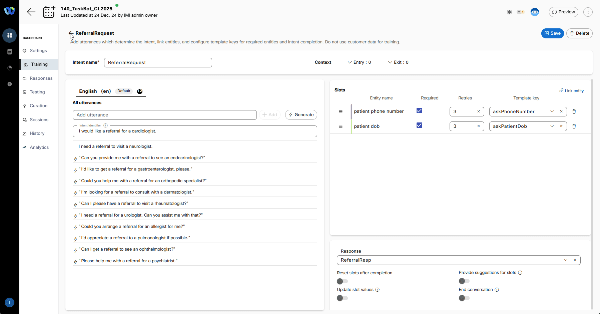  

9. Test the updated bot flow by using the **Preview** button and inputting queries related to the new training data.

     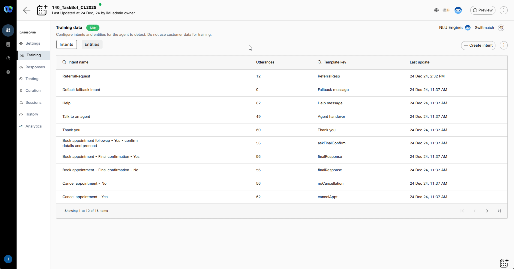

---

#### Bot Transcripts & Analytics

In this step, we will explore how to access and analyze bot transcripts and analytics to gain insights into user interactions.

1. Click on **Sessions** in the left-hand panel of your bot builder interface to view all the call history. Click on any Session ID to delve into a more detailed analysis of that particular interaction.

2. If you encounter encrypted content, click on **Decrypt Content** to proceed with the review.

3. Review the transcript for the selected interaction to gain insights into how the conversation unfolded.

    

4. Click on individual messages from the user to examine the intents and entities identified by the Virtual Agent during the conversation.

5. By carefully analyzing these transcripts and analytics, you can identify areas for improvement, understand user behavior, and refine the Virtual Agent's performance accordingly. 

    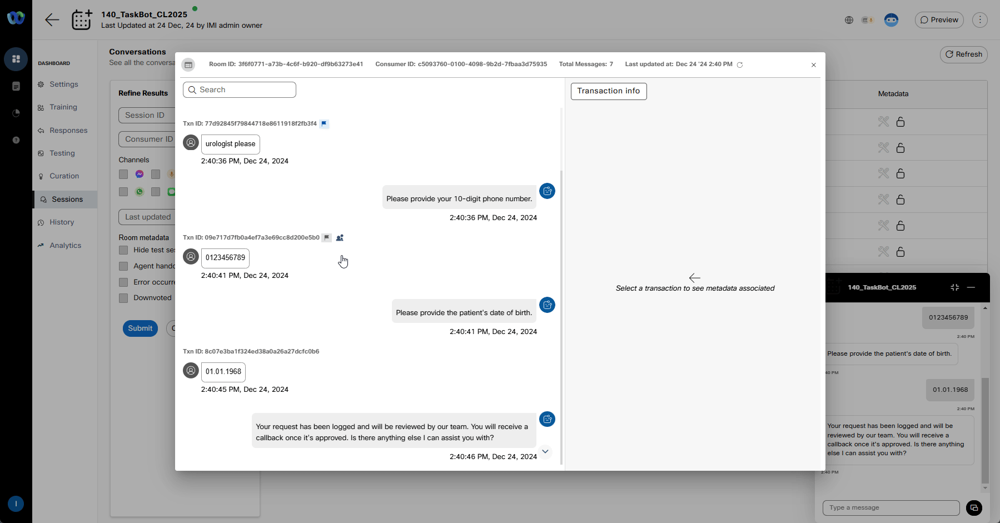

<strong>Congratulations, you have officially completed the Cisco Virtual Assistant mission! 🎉🎉 </strong>

