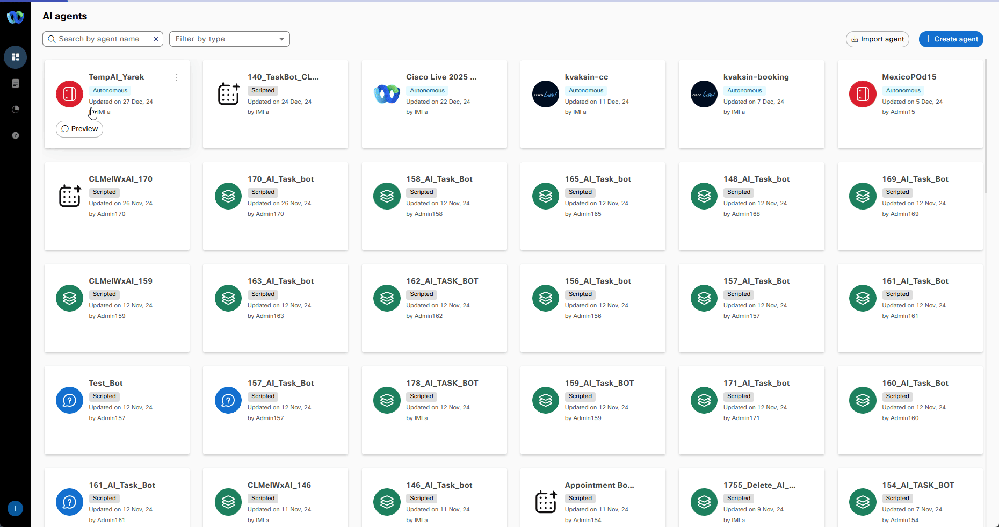
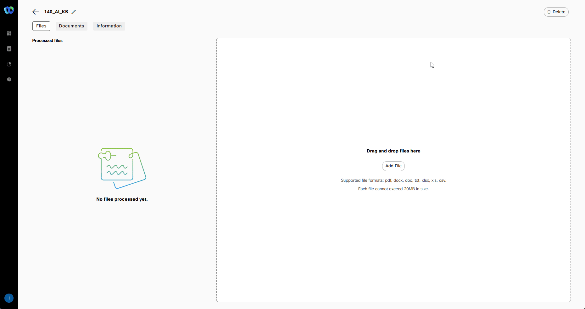
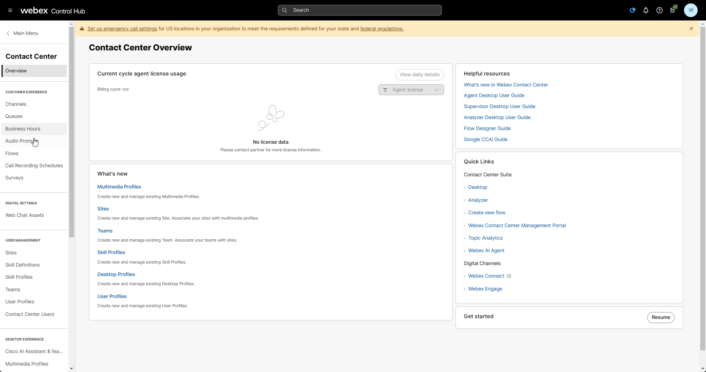
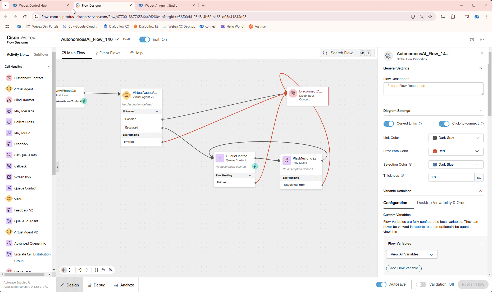

# Mission 7: AI in Action (Autonomous Agent)

## AI Autonomous Agent Overview

The Autonomous AI Agent for performing actions can handle various tasks, including:

  - Natural Language Processing (NLP)—Understand and respond to human language in a natural and conversational manner.
  - Decision making—Make informed choices based on available information and predefined rules.
  - Automation—Automate repetitive or time-consuming tasks.

## Mission overview

In current mission you would need to create a knowledge bases (KB). You are going to build a KB for your AI agent to provide answers about Amsterdam (aka **Amsterdam Tourist Guide**): places to visit, restaurants, night clubs and how to get there from current RAI Amsterdam Convention Center.

---

## Build

### Creating a Knowldge Base

1. [IMPORTANT] [Download](https://drive.google.com/drive/folders/1b8x_om4rQonuJ52wRYif1LPP5qEX4RDI?usp=sharing){:target="_blank"} source files from shared folder. Choose either any or all files from the following list:
    
    > 
    > **Amsterdam_Tourist_Guide.txt**
    >

2. Login into [Webex Control Hub](https://admin.webex.com){:target="_blank"} by using your Admin profile **wxcclabs+admin_IDYour_Attendee_ID@gmail.com**. You will see another login screen with OKTA on it where you may need to enter the email address again and the password provided to you.

3. Go to Contact Center from the left side navigation panel, and under Quick Links, click on **Webex AI Agent**

      

4. In AI Agent Builder navigate to **Knowledge** from left hand side menu panel. 

5. Click **Create Knowledge Base**, provide Knowledge base name as **Your_Attendee_ID_AI_KB**, then click **Create**.

    

6. Click **Add File** or drag and drop the files **Amsterdam Tourist Guide** you downloaded from external drive on **Step 1** - TXT file information for tourists: places to visit, restaurants, pubs etc. and how to reach those places from RAI Amsterdam Convention Center 

    

7. Navigate to **Dashboard** from the right-hand side menu panel and click **Create Agent**
8. Select **Create from Scratch** and click **Next**
9. On **Define agent** page select the following, then click next:
    
    > 
    > What type of agent are you building?: **Autonomous**
    >
    > What's your agent's main function?: **Answer questions**

10. On **Set up profile** provide te following information, then click **Create**:

    > Agent Name: **Your_Attendee_ID_AutoAI_Lab**
    >
    > System ID is created automatically
    >
    > AI engine: **Nova**
    >
    > Knowledge base: **Your_Attendee_ID_AI_KB**
    > 
    > Agent's goal: <copy>***You are a helpful, polite agent who will help the user with their Amsterdam related queries such as restaurant, pubs, places to visit and what transport can be used to get there. In addition, you as an agent can provide comprehensive information about Cisco Live 2025 Amsterdam event such as schedule, registration information, session catalog and general help information.***</copy>
    > 

    

11. Toggle **Allow agent handover** setting on **AI agent settings** page and click **Save Changes**. This will allow you to handoff calls to human agent on request while talking to your Virtual Agent.

    

12. Click on **Preview** to test your AI Agent and ask the following: **"I'm looking for an Italian restaurant close to RAI."**

    

---

## Integrating the Bot with Flow for Voice Calls

1. In Control Hub navigate to **Flows**, click on **Manage Flows** dropdown list and select **Create Flows**

2. Select Start Fresh and name the new flow **AutonomousAI_Flow_Your_Attendee_ID**

      

3. Make sure the Edit button at the top is set to **ON**. Then, drag and drop the **Virtual Agent V2** and **DisconnectContact** activities from the left panel onto the canvas.

    !!! Note
        Please make sure to use **VirtualAgentV2** activity and **NOT** **VirtualAgent** also present on the Activity Library for Backward Compatability.

    > Connect the **New Phone Contact** output node edge to this **VirtualAgentV2** node
    >
    > Connect the Handled outputs to **DisconnectContact** 
    >
    > Connect the Errored outputs to **DisconnectContact** 
    >
    > Set **Static Contact Center AI Config**
    >
    > Contact Center AI Config: **Webex AI Agent (Autonomous)**
    >
    > Virtual Agent: **Your_Attendee_ID_AutoAI_Lab**

      

4. Drag and drop following nodes:

    - **Queue Contact** activity onto the Flow from the left side panel

      >
      > Connect the **Escalated** path from the **Virtual Agent V2** activity to the **Queue Contact** activity.
      >
      > Connect the **Queue Contact** activity to the **Play Music** activity
      >
      > Connect the **Failure** path from the **Queue Contact** activity to the **Disconnect Contact** activity.
      > 
      > Queue name: **Your_Attendee_ID_Queue**
      > 

    - **Play Music**

      >
      > Create a loop by connecting the Play Music activity back to itself - to create a music loop, following the diagram provided.
      >
      > Connect the **Failure** path from the **Play Music** activity to the **Disconnect Contact** activity.
      > 
      > Music File: **defaultmusic_on_hold.wav**
      >
  
5. **Validate** and **Publish** Flow. In popped up window click on dropdown menu to select **Latest** label, then click **Publish**  

      

6. Assign the Flow to your **Channel (Entry Point)** - Do this by first going to **Channel** > Search for your channel **Your_Attendee_ID_Channel**.
7. Click on **Your_Attendee_ID_Channel**
8. In **Entry Point** Settings section change the following:

    > Routing Flow: **AutonomousAI_Flow_Your_Attendee_ID**

    > Version Label: **Latest**

      

9. Dial Support Number assigned to your **Your_Attendee_ID_Channel** to test the Autonomous Virtual Agent over a voice call.

## Testing

1. Your Agent desktop session should be still active but if not, use Chrome Agent Profile to open [Agent Desktop](https://desktop.wxcc-us1.cisco.com/){:target="_blank"} and login with agent credentials you have been provided **wxcclabs+agent_IDYour_Attendee_ID@gmail.com**. You will see another login screen with OKTA on it where you may need to enter the email address again and the password provided to you. 
2. Select **Desktop** as a ***Telephony Option*** and Team **Your_Attendee_ID_Team**. Click **Submit**. Allow browser to access Microphone by clicking **Allow** on ever visit.
3. Make your agent ***Available*** and you're ready to make a call.

    

4. Dial the support number assigned to your **Your_Attendee_ID_Channel** channel and during the conversation with the virtual Agent ask something about restaurants in Amsterdam or places where you can go and watch historical.

5. Any time during conversation request to connect you with a live agent. The call will be transferred to your agent.

<strong>Congratulations, you have officially completed the Autonomous Virtual Agent mission! 🎉🎉 </strong>

