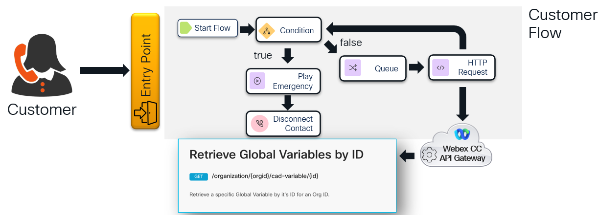
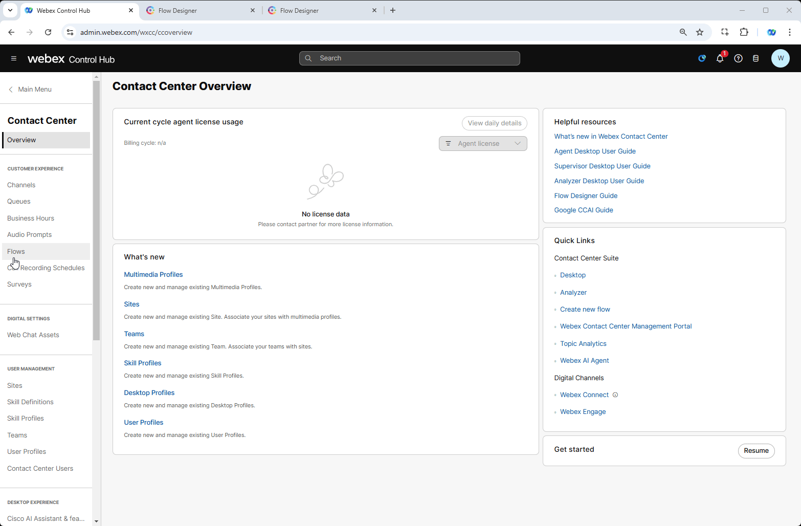
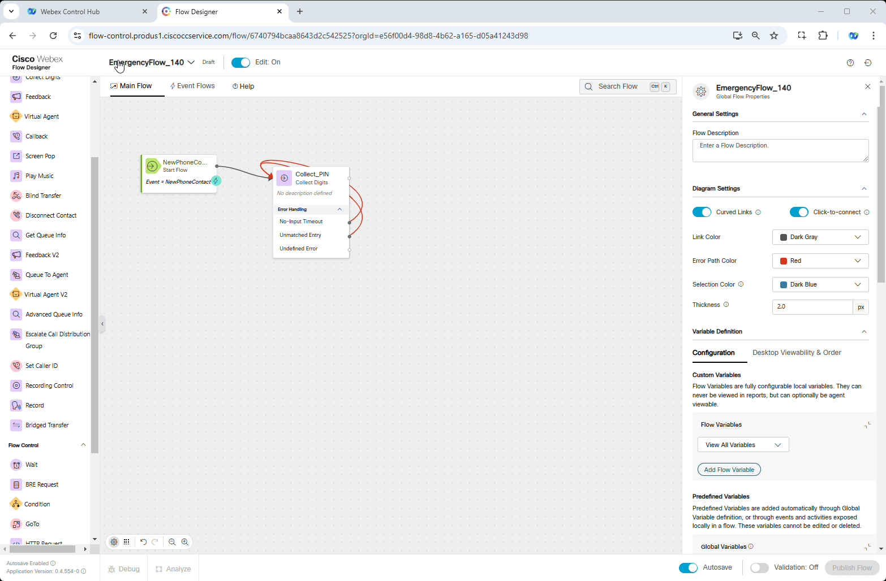
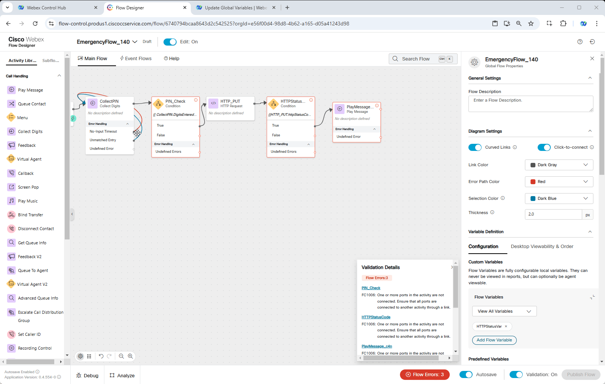
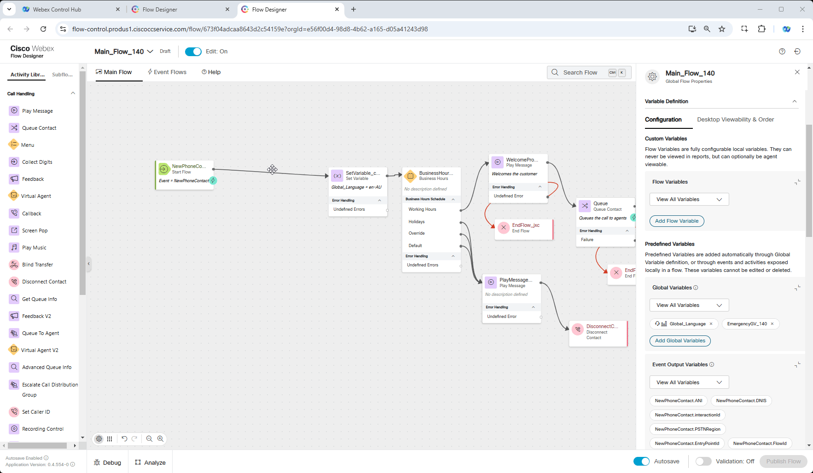
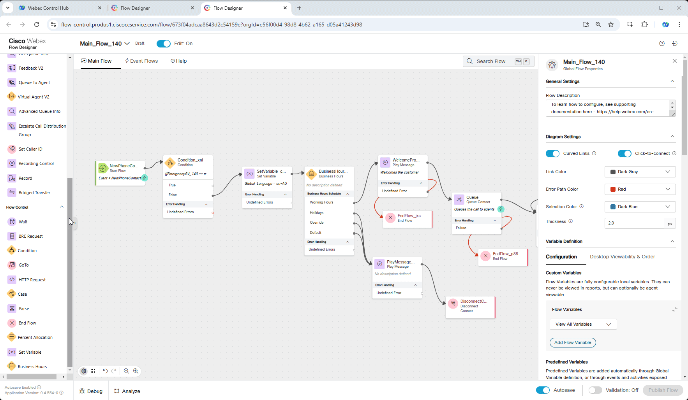

# Mission 3: HTTP API POST to Control Hub (Emergency config change)

## Story

Consider a scenario where a supervisor needs ability to change routing decision during an emergency without accessing admin portal. It can be done by changing the **Default Value** of GlobalVariable via API PUT call from False to True and use Condition in main IVR script to do routing decision. 
In this mission we are going to create a control script for Supervisors that changes default value of Global Variable from **True** to **False** 


   


## Build


1. In Control Hub Flows page open **Global Variables** tab and create new Global Variable:

    > Name: **<span class="attendee-id-container">EmergencyGV_<span class="attendee-id-placeholder" data-prefix="EmergencyGV_">Your_Attendee_ID</span><span class="copy" title="Click to copy!"></span></span>**
    > Type: **Boolean**
    > Default Value: **False**
    > 
    > Copy your new created **Global Variable** **ID** and **Name** to a notepad. We are going to use them in API request in further steps.
    >

    


2. Create a new flow with a name **<span class="attendee-id-container">EmergencyGV_<span class="attendee-id-placeholder" data-prefix="EmergencyGV_">Your_Attendee_ID</span><span class="copy" title="Click to copy!"></span></span>**
    
3. Add a **Collect Digits** node:
    
    > Rename node to **CollectPIN**
    >
    > Connect the **New Phone Contact** output node edge to this **Collect Digits** node
    >
    > Loop No-Input Timeout and Unmatched Entry to itself
    >
    > Enable Text-To-Speech
    >
    > Select the Connector: **Cisco Cloud Text-to-Speech**
    >
    > Click the Add Text-to-Speech Message button
    >
    > Delete the Selection for Audio File
    >
    > Text-to-Speech Message: ***Please enter 4 digits pin code to activate emergency flow.***<span class="copy-static" data-copy-text="Please enter 4 digits pin code to activate emergency flow."><span class="copy" title="Click to copy!"></span></span>
    >
    > Set checkbox in **Make Prompt Interruptible**
    
    

    
4. Add **Condition Node** and rename it to **PIN_Check**

    > Connect the output node edge from the **Collect Digits** node to this node
    >
    > In the Expression section write an expresion ***{{ CollectPIN.DigitsEntered == '1111'}}***<span class="copy-static" data-copy-text="{{ CollectPIN.DigitsEntered == '1111'}}"><span class="copy" title="Click to copy!"></span></span>
    
    <span style="color: orange;">[Optional]</span> You can verify the expresion result by clicking on **Test Expression** icon in the Expresion section
        
    
    
5. Add **HTTP Request** node to the flow and rename it to **HTTP_PUT**

    > Connect the **TRUE** output edge from the **PIN_Check** node to this node
    > 
    > Connector: **WxCC_API**
    >
    > Request Path: **/organization/e56f00d4-98d8-4b62-a165-d05a41243d98/cad-variable/*{ID}***<span class="copy-static" data-copy-text="/organization/e56f00d4-98d8-4b62-a165-d05a41243d98/cad-variable/{ID}"><span class="copy" title="Click to copy!"></span></span> - change ***{ID}*** with Global Variable ID you created in **Step 2** of this mission.
    >
    > Method: **PUT**
    >
    > Content Type: **Application/JSON**
    >
    > Request Body:
    ``` JSON
    {
        "active": true,
        "agentEditable": false,
        "agentViewable": false,
        "variableType": "Boolean",
        "defaultValue": "true",
        "desktopLabel": "",
        "id": "yourGlobalVariableID created in step 1",
        "name": "yourGlobalVariable name created in step 1",
        "organizationId": "e56f00d4-98d8-4b62-a165-d05a41243d98",
        "reportable": false,
        "version": 1
    }
    ```

    !!! Note
        In Request body we are going to change Default Value of Global Variable **EmergencyGV_<span class="attendee-id-placeholder">Your_Attendee_ID</span>**  from ***false*** to ***true***

    

    
6. Add one more **Condition Node** and rename it to **HTTPStatusCode**. In this node we are going to check the status of our API PUT request. If it is **200 OK** the output will be **True** and if other than **200** then **False**.
    
    > Connect the output node edge from the **HTTP_PUT** node to this node
    >
    > In the Expression section write an expresion ***{{HTTP_PUT.httpStatusCode == 200}}***<span class="copy-static" data-copy-text="{{HTTP_PUT.httpStatusCode == 200}}"><span class="copy" title="Click to copy!"></span></span>
    
    

    
7. Add a **Play Message** node 
    
    > Connect the **HTTPStatusCode** TRUE output node edge to this **Play Message** node
    >
    > Enable Text-To-Speech
    >
    > Select the Connector: **Cisco Cloud Text-to-Speech**
    >
    > Click the Add Text-to-Speech Message button
    >
    > Delete the Selection for Audio File
    >
    > Text-to-Speech Message: ***You have successfully modified your emergency configuration.***<span class="copy-static" data-copy-text="You have successfully modified your emergency configuration."><span class="copy" title="Click to copy!"></span></span>
    
    
    
8. Add another **Play Message** node

    > Connect the **HTTPStatusCode** FALSE output node edge to this **Play Message** node
    >
    > Connect the **PIN_Check** FALSE output node edge you created in **Step 5** to this **Play Message** node
    >
    > Enable Text-To-Speech
    >
    > Select the Connector: **Cisco Cloud Text-to-Speech**
    >
    > Click the Add Text-to-Speech Message button
    >
    > Delete the Selection for Audio File
    >
    > Text-to-Speech Message: ***Something went wrong. Please check your configuration and try again.***<span class="copy-static" data-copy-text="Something went wrong. Please check your configuration and try again."><span class="copy" title="Click to copy!"></span></span>
    
    
    
9. Add **Disconnect Contact**

    > Connect both **Play Message** nodes created in **Steps 8** and **9** to this node
    

10. Publish your flow

    > Turn on Validation at the bottom right corner of the flow builder
    >
    > If there are no Flow Errors, Click **Publish**
    >
    > Add a publish note
    >
    > Add Version Label(s): **Latest**
    >
    > Click **Publish Flow**
    
11. Map your flow to your inbound channel
    
    > Navigate to Control Hub > Contact Center > Channels
    > 
    > Locate your Inbound Channel (you can use the search):  **<span class="attendee-id-container"><span class="attendee-id-placeholder" data-suffix="_Channel">Your_Attendee_ID</span>_Channel<span class="copy" title="Click to copy!"></span></span>**
    > 
    > Select the Routing Flow: **<span class="attendee-id-container">EmergencyGV_<span class="attendee-id-placeholder" data-prefix="EmergencyGV_">Your_Attendee_ID</span><span class="copy" title="Click to copy!"></span></span>**
    > 
    > Select the Version Label: **Latest**
    > 
    > Click **Save** in the lower right corner of the screen


## Testing
   
1. Open your Global Variable **<span class="attendee-id-container">EmergencyGV_<span class="attendee-id-placeholder" data-prefix="EmergencyGV_">Your_Attendee_ID</span><span class="copy" title="Click to copy!"></span></span>** and make sure Default Value is set to **False**
    
2. Make a call to your Support Number, when asked provide a pin code 1111# and listen the next message:

    > a. If ***"You have successfully modified your emergency configuration."***<span class="copy-static" data-copy-text="You have successfully modified your emergency configuration."><span class="copy" title="Click to copy!"></span></span> you're good to proceed with step 3.
    >
    > b. If ***"Something went wrong. Please check your configuration and try again."***<span class="copy-static" data-copy-text="Something went wrong. Please check your configuration and try again."><span class="copy" title="Click to copy!"></span></span> then before proceeding you need to fix your flow. Call the instructor for assistance.
     >

3. Open your Global Variable **<span class="attendee-id-container">EmergencyGV_<span class="attendee-id-placeholder" data-prefix="EmergencyGV_">Your_Attendee_ID</span><span class="copy" title="Click to copy!"></span></span>** again, refresh the page if it was opened and make sure **Default Value** is now set to True.


4. Now the fun part. Open your **<span class="attendee-id-container">Main_Flow_<span class="attendee-id-placeholder" data-prefix="Main_Flow_">Your_Attendee_ID</span><span class="copy" title="Click to copy!"></span></span>** we created in Mission 1 of Fundamental Labs, make it editable and add Global Variable **<span class="attendee-id-container">EmergencyGV_<span class="attendee-id-placeholder" data-prefix="EmergencyGV_">Your_Attendee_ID</span><span class="copy" title="Click to copy!"></span></span>**and make sure Default Value is set to **False** in General Settings of the flow

    
    
5. Add **Condition**: 
    
    > Connect the output node edge of the **NewPhoneContact** node to this node
    > 
    > Connect the output False node edge from the **Condition** Node to **Set Variable**
    > 
    > **[Copy doesn't work. to fix]** In the Expression section write an expresion ***{{EmergencyGV_<span class="attendee-id-placeholder">Your_Attendee_ID</span> == true}}***  
            
    <details><summary>Optional</summary>You can Verify the expresion result by Clicking on **Test Expression** icon in the Expresion section.</details>
        
    


6. Add a **Play Message** node and **Disconnect node**.
    
    > Connect the **TRUE** output node edge of the **Condition Node** node to this node
    > 
    > Connect the output node edge of **Play Message** node to **DiscinnectContact node**.
    > 
    > Enable Text-To-Speech
    > 
    > Select the Connector: **Cisco Cloud Text-to-Speech**
    > 
    > Click the Add Text-to-Speech Message button
    > 
    > Delete the Selection for Audio File
    > 
    > Text-to-Speech Message: ***Sorry, Emergency flow has been enabled. All operators have been evacuated. Please call later.***<span class="copy-static" data-copy-text="Sorry, Emergency flow has been enabled. All operators have been evacuated. Please call later."><span class="copy" title="Click to copy!"></span></span>
    
    
        
7. Because we are using only one number to make calls we need to map your **<span class="attendee-id-placeholder">Your_Attendee_ID</span>_Channel** back to the **Main_Flow_<span class="attendee-id-placeholder">Your_Attendee_ID</span>**
    
    > Navigate to Control Hub > Contact Center > Channels
    >
    > Locate your Inbound Channel (you can use the search): **<span class="attendee-id-container"><span class="attendee-id-placeholder" data-suffix="_Channel">Your_Attendee_ID</span>_Channel<span class="copy" title="Click to copy!"></span></span>**
    >
    > Select the Routing Flow: **<span class="attendee-id-container">Main_Flow_<span class="attendee-id-placeholder" data-prefix="Main_Flow_">Your_Attendee_ID</span><span class="copy" title="Click to copy!"></span></span>**
    >
    > Select the Version Label: **Latest**
    >
    > Click **Save** in the lower right corner of the screen
    

8. Make a call and you should hear the message we configured on **Step 6**.
    
9. Revert the Global Variable value from **True** to **False** in Control Hub. In Control Hub Flows page open Global Variables tab and create new Global Variable. 

    > Name: **<span class="attendee-id-container">EmergencyGV_<span class="attendee-id-placeholder" data-prefix="EmergencyGV_">Your_Attendee_ID</span><span class="copy" title="Click to copy!"></span></span>** 
    
    > Type: **Boolean**
    >
    > Default Value: **False**
    
    
    
    
10. Make a test call again and you should hear the message configured in Basic Lab at the very beginning.


### Summary
This lab shows how to quickly change the behavior of your contact center logic in extreme situation without even login-in in to Control Hub.