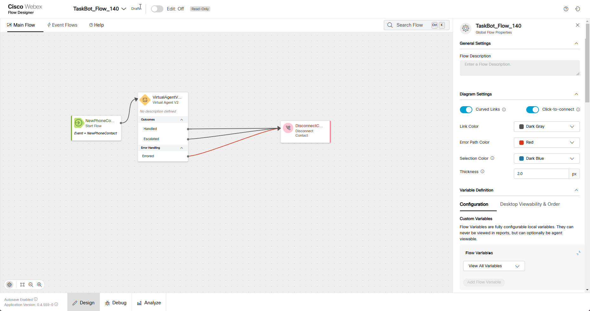
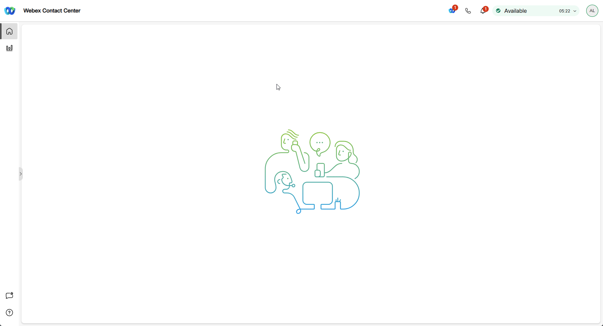
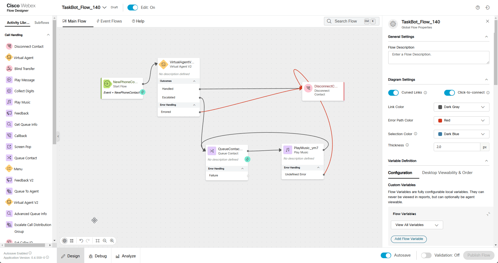
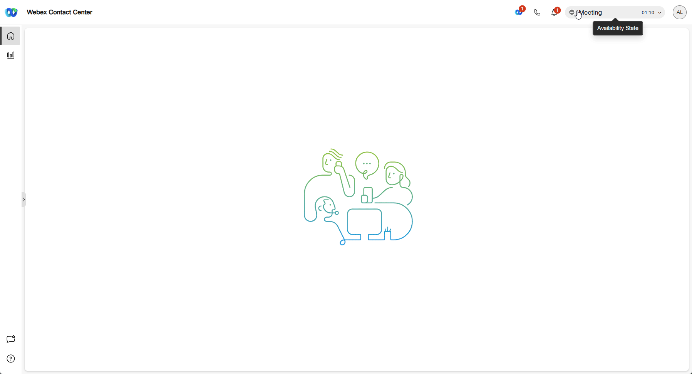
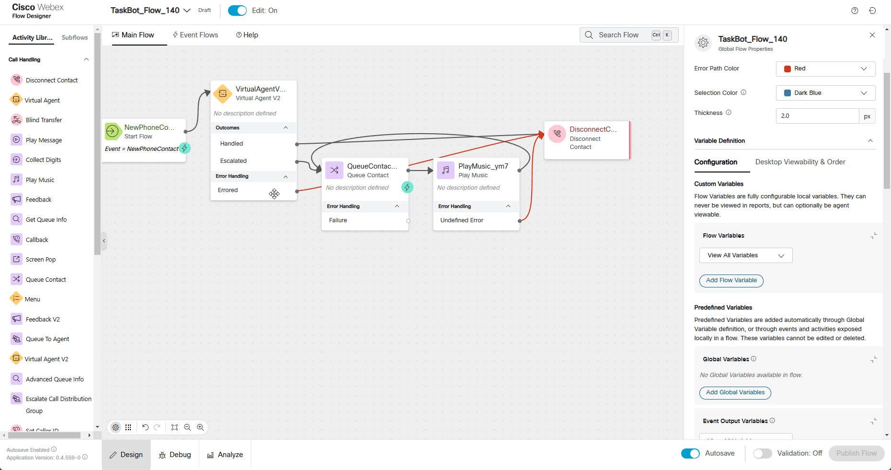
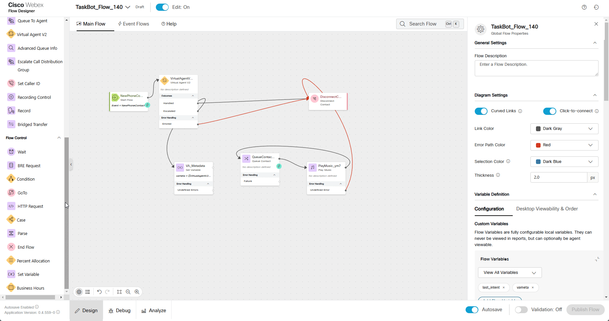
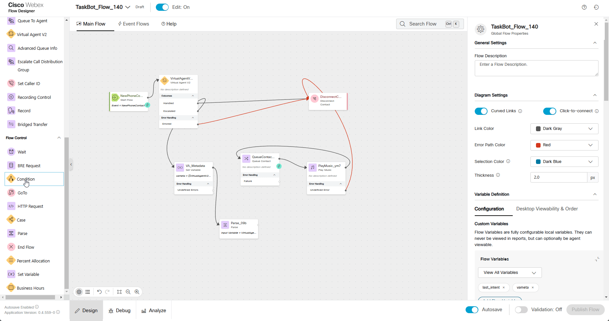
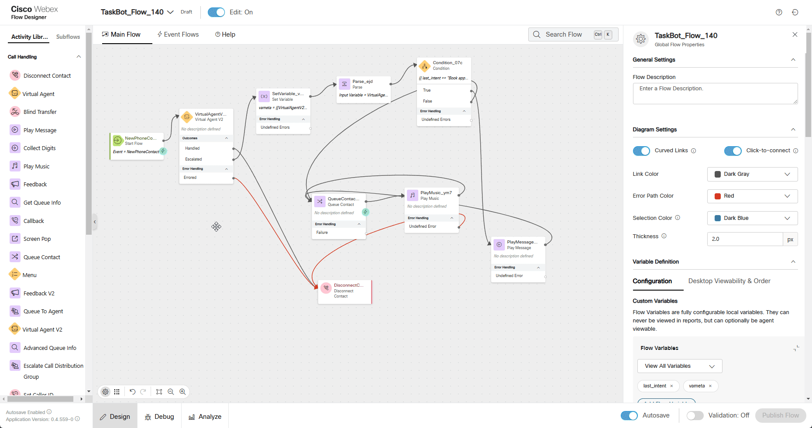
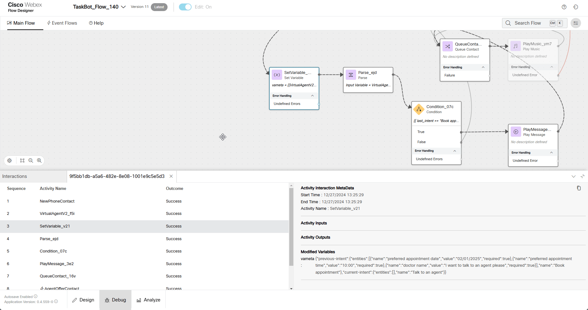
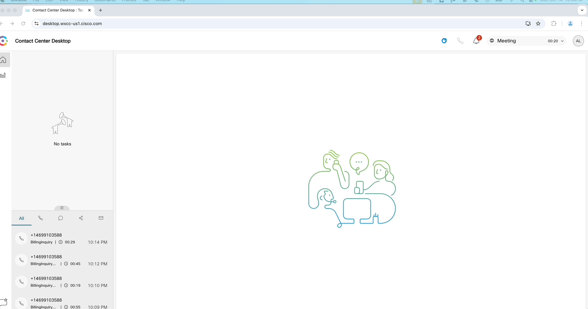

# Mission 7: Seamless AI to Human Agent Handoffs

> !!! Note
      This task relies on completing Mission 7 of the Fundamental Labs. Ensure that mission is completed to have a fully functional AI Scripted Agent feature in the Contact Center.

## Objectives

This lab is designed to explore how to pass contextual intelligence from AI Agents to Webex Contact Center agents. It involves leveraging AI Summaries for Webex AI  agent conversational transcripts . By completing this lab, you will gain practical skills and knowledge on how to provide the right context to agents to better handle customer queries.

By the end of this lab, you will:

  - Understand how to effectively transfer and hand off to Human Agents.
  - Learn how to provide the relevant call context to Human Agents.

## Build

### Transfer to Human Agent

1. Before you start this lab, please make sure the webex contact center **Your_Attendee_ID_Channel** is set your **TaskBot_Flow_Your_Attendee_ID**.

      

2. In **Control Hub** select **Contact Center** from the left panel and then navigate to Flows from the left panel. Search and open your flow **TaskBot_Flow_Your_Attendee_ID**. 

3. Switch the Edit button to **On** to enable Edit mode in the flow builder then drag and drop following nodes:

    - **Queue Contact** activity onto the Flow from the left side panel

      >
      > Connect the **Escalated** path from the **Virtual Agent V2** activity to the **Queue Contact** activity.
      >
      > Connect the **Queue Contact** activity to the **Play Music** activity
      >
      > Connect the **Failure** path from the **Queue Contact** activity to the **Disconnect Contact** activity.
      > 
      > Queue name: **Your_Attendee_ID_Queue**
      > 

    - **Play Music**

      >
      > Create a loop by connecting the Play Music activity back to itself - to create a music loop, following the diagram provided.
      >
      > Connect the **Failure** path from the **Play Music** activity to the **Disconnect Contact** activity.
      > 
      > Music File: **defaultmusic_on_hold.wav**
      >
  
4. **Validate** and **Publish** Flow. In popped up window click on dropdown menu to select **Latest** label, then click **Publish**  

    

### Checkpoint: Transfer to Human Agent

1. Your Agent desktop session should be still active but if not, use Webex CC Desktop application  and login with agent credentials you have been provided **wxcclabs+agent_IDYour_Attendee_ID@gmail.com**. You will see another login screen with OKTA on it where you may need to enter the email address again and the password provided to you. 
2. Select Team **Your_Attendee_ID_Team**. Click **Submit**. Allow browser to access Microphone by clicking **Allow** on ever visit.
3. Make your agent ***Available*** and you're ready to make a call.

    

4. Dial the support number assigned to your **Your_Attendee_ID_Channel** channel and during the conversation with the virtual Agent, say, **"Please transfer me to an Agent."** Answer the call on the agent desktop when you receive a ring notification and verify the trasciption is passed to Agent Desktop.

5. Once the call is answered, disconnect the call by clicking on the **End** button.

    

### Disable Virtual Agent Transcript

1. Open your flow **TaskBot_Flow_Your_Attendee_ID** and switch **Edit: Off** mode to **Edit: On** if it's not.
2. Select the **Virtual Agent v2** activity and, in the right side panel, scroll down and notice the option for **Enable Conversation Transcript**.
3. Disable the **Virtual Agent v2** transcript by unchecking **Enable Conversation Transcript** option.
4. **Validate** and **Publish** Flow. In popped up window click on dropdown menu to select **Latest** label, then click **Publish** .

    

### Checkpoint: Disable Virtual Agent Transcript
1. Make sure your agent is **Available** and if not, login to you Desktop as explained in previous Quick Test (see above)
2. Dial into the same support and observe that the conversation transcript is **Not available** on the Agent Desktop when **Enable Conversation Transcript** is unchecked.

    

### Routing Based on Last Intent

1. **[IMPORTANT]** Please make sure to Enable the Virtual Agent transcript by checking **Enable Conversation Transcript** option for the **Virtual Agent V2** activity. Select the **Virtual Agent V2** activity and, in the right side panel, scroll down and notice the option for **Enable Conversation Transcript**. 

2. Enable the **Virtual Agent v2** transcript by checking **Enable Conversation Transcript** option.

    

3. Add 2 new flow variables: 
    
    >
    > Name: **`last_intent`**
    >
    > Type: **`String`**
    >
    > Default Value: **`empty`**
    >
    > Name: **`vameta`**
    >
    > Type: **`JSON`**
    >
    > Default Value: **`{}`**
    >

    

4. Drag **Set Variable** node to canvas:

    > Activity Name: **`VA_Metadata`**
    >
    > Variable: **`vameta`**
    >
    > Set To Variable: **`VirtualAgentV2_`****<>****`.MetaData`**
    > 
    > Connect **`Escalated`** edge of **VirtualAgent** to the **VA_Metadata** node
    >

    !!! Note
        <*> in VirtualAgentV2 name is autogenerated and is different in all cases. You shouldn't be confused as you have only one VirtualAgentV2 node in the current flow

    

5. Drag and drop the **Parse** activity to the flow

    >
    > Connect the **VA_Metadata** activity to the **Parse** activity.
    >
    > Input variable: **`VirtualAgentV2_`****<>****`.MetaData`**
    >
    > Content Type: **`JSON`**
    >
    > Output Variable: **`last_intent`**
    >
    > Path Expression: **`$.previous-intent.name`**

    

6. Drag and drop the **Condition** activity to the flow

    >
    > Connect the **Parse** activity to the **Condition** activity.
    >
    > Connect the **False** output from the **Condition** activity to the **Queue Contact** activity
    > 
    > Condition : **{{ last_intent == "Book appointment" }}**

7. Add **Play Message**: 
    
    > Enable Text-To-Speech
    >
    > Select the Connector: **Cisco Cloud Text-to-Speech**
    >
    > Click the Add Text-to-Speech Message button and paste text: **Routing to an agent skilled at booking an appointment.**
    >
    > Delete the Selection for Audio File
    >
    > Connect **True** exit path of **Condition** node created in **Step 5** to this **Play Message** node
    > 
    > Connect **Play Message** node to **Queue Contact**
    >

8. **Validate** and **Publish** Flow. In popped up window click on dropdown menu to select **Latest** label, then click **Publish** 

    

### Checkpoint: Last Intent Based Routing
    
1. Make sure your agent is **Available** and if not, login to you Desktop as explained in previous Quick Test (see above)
2. Make a call to your test number. During your interaction with the Virtual Agent start requesting for an appointement and then request a transfer to a live agent by saying, **"Please transfer me to an Agent."** If the last intent was "Book appointment", you will hear the Text-to-Speech message: **"Routing to an agent skilled at booking an appointment."**. 

    <!-- md:option type:note -->
    
    !!! note "Sample Conversation"
        "I would like to Book  an appointment"
    
        What date are you considering for your visit 
    
        "Feb 20th"
    
        Could tell us preferred time for your visit 
    
        "3PM"
    
        Which doctor you want appointment with
      
        "Dr John"
    
        What is name of the  patience 
    
        "Peter<any name>"
    
        Could you tell us patience Date of Birth
    
        "Please transfer me to an agent "

5. Answer the call on the agent desktop when it rings.
6. Go back to your flow and click on **Analyze** tab at the bottom of the canvas. Observe the last call behavior.
7. Open Debug tool and open your last call. Click on **VA_Metadata** which is our renames Set Variable. See that metadata from **VirtualAgentV2_<*>.MetaData** was written into **vameta** flow variable we created on **Step 3**.
  

8. Copy JSON from debuger and paste it into [https://jsonpath.com/](https://jsonpath.com/){:target="_blank"} Inputs.
9. Change Debug mode to Design in Flow Designer and copy the path from Parse node into JSONPath of the [https://jsonpath.com/](https://jsonpath.com/){:target="_blank"}. You should get last intent name as "Book Apppointement"

  

### Checkpoint: AI assistant
1. Click on the AI assistant icon located on the top left navigation panel.

    

2. Dial the support number assigned to your **Your_Attendee_ID_Channel** and initiate a conversation with below

3. During the interaction with the virtual Agent, request a transfer by saying, **"Please transfer me to an Agent."** Answer the call on the agent desktop upon receiving the ring notification.

4. Observe that, after answering the call, a summary of the Virtual Agent interaction is now displayed on the agent desktop

  

<strong>Congratulations, you have officially completed the Intelligent Virtual Agent Handoffs mission! 🎉🎉 </strong>

