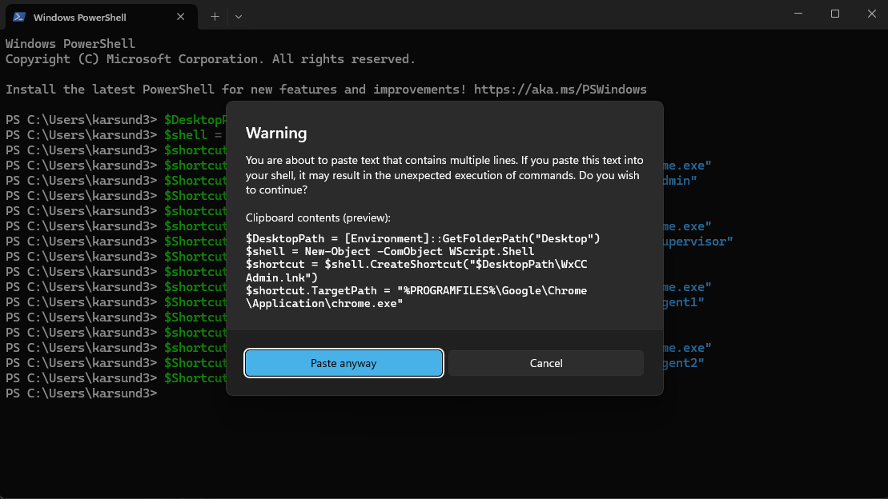

## Steps to setup each laptop in the room.

0. Download and save on desktop a txt file for current pod from [**User Credentials**](https://cisco.box.com/s/3fz3m4a1tkzh8entx2lnon8y9z2s9zpw){:target="_blank"}. Example **ID \<id\> - LTRCCT-2966 Credentials**, where **\<id\>** is the POD ID of current desktop.
</br>


1. On each laptop access lab -assistant with pin code 447094
2. Click on Documentation. Go to Getting Started -> **LAB ROOM SETUP**

---

### Creating Chrome user profiles

Open the Windows Terminal (Windows key and type **Powershell**). Paste and run the following code. After running the script you should find 2 Chrome shortcuts created - **WxCC Admin** and **WxCC Agent1**.

```
# ================================
# Helper function to create Chrome profile, shortcut, profile name, and bookmarks
# ================================
function New-ChromeProfile {
    param(
        [string]$ProfileFolderName,   # Folder under chromeProfiles (e.g. 'admin', 'agent')
        [string]$ProfileDisplayName,  # Name Chrome will show (e.g. 'Admin', 'Agent')
        [string]$ShortcutName,        # Shortcut file name
        [array]$Bookmarks             # Array of bookmark objects @{ name=""; url="" }
    )

    $DesktopPath = [Environment]::GetFolderPath("Desktop")
    $ProfilePath = "$env:USERPROFILE\chromeProfiles\$ProfileFolderName"
    $DefaultProfilePath = "$ProfilePath\Default"
    $PreferencesFile = "$DefaultProfilePath\Preferences"
    $BookmarksFile = "$DefaultProfilePath\Bookmarks"

    # --- Ensure profile directory exists ---
    if (!(Test-Path $DefaultProfilePath)) {
        New-Item -ItemType Directory -Path $DefaultProfilePath -Force | Out-Null
    }

    # --- Create desktop shortcut ---
    $shell = New-Object -ComObject WScript.Shell
    $shortcut = $shell.CreateShortcut("$DesktopPath\$ShortcutName")
    $shortcut.TargetPath = "$env:ProgramFiles\Google\Chrome\Application\chrome.exe"
    $shortcut.Arguments = "--user-data-dir=$ProfilePath"
    $shortcut.Save()

    # --- Update Preferences file (set profile name) ---
    if (!(Test-Path $PreferencesFile)) {
        @"
{
  "profile": {
    "name": "$ProfileDisplayName"
  }
}
"@ | Set-Content -Path $PreferencesFile -Encoding UTF8
    } else {
        $json = Get-Content $PreferencesFile -Raw | ConvertFrom-Json
        if (-not $json.profile) {
            $json | Add-Member -MemberType NoteProperty -Name 'profile' -Value @{ name = $ProfileDisplayName }
        } else {
            $json.profile.name = $ProfileDisplayName
        }
        $json | ConvertTo-Json -Depth 10 | Set-Content $PreferencesFile -Encoding UTF8
    }

    # --- Build bookmark children array dynamically ---
    $children = @()
    $id = 1
    foreach ($bm in $Bookmarks) {
        $children += @{
            date_added = "13200000000000000"
            id = "$id"
            name = $bm.name
            type = "url"
            url  = $bm.url
        }
        $id++
    }

    # --- Complete bookmark JSON ---
    $BookmarkJson = @{
        roots = @{
            bookmark_bar = @{
                children = $children
                date_added = "13200000000000000"
                date_modified = "13200000000000000"
                id = "100"
                name = "Bookmarks bar"
                type = "folder"
            }
            other = @{
                children = @()
                id = "101"
                name = "Other bookmarks"
                type = "folder"
            }
            synced = @{
                children = @()
                id = "102"
                name = "Synced bookmarks"
                type = "folder"
            }
        }
        version = 1
    }

    $BookmarkJson | ConvertTo-Json -Depth 10 | Set-Content -Path $BookmarksFile -Encoding UTF8

    Write-Host "Profile '$ProfileDisplayName' created with $($Bookmarks.Count) bookmark(s)."
}

# ================================
# Create Admin profile (2 bookmarks)
# ================================
New-ChromeProfile `
    -ProfileFolderName "admin" `
    -ProfileDisplayName "Admin" `
    -ShortcutName "WxCC Admin.lnk" `
    -Bookmarks @(
        @{ name = "LTRCCT-2966"; url = "https://webexcc-sa.github.io/LTRCCT-2296/" },
        @{ name = "Webex Control Hub"; url = "https://admin.webex.com/" }
    )

# ================================
# Create Agent profile (1 bookmark)
# ================================
New-ChromeProfile `
    -ProfileFolderName "agent" `
    -ProfileDisplayName "Agent" `
    -ShortcutName "WxCC Agent.lnk" `
    -Bookmarks @(
        @{ name = "Agent Desktop"; url = "https://desktop.wxcc-us1.cisco.com/" }
    )

```

- Click on **Past anyway** if asks.



- Check the desktop of your lab PC. You should find 2 Chrome shortcuts created - **WxCC Admin** and **WxCC Agent1**


### Configure apps for Admin, Agent and Supervisor

1. Open **WxCC Admin**, check bookmarked URLs. Login to **Control Hub** by using Admin account from TXT file you downloaded on **Step 1**.
2. Save the password in the browser.
3. Open **WxCC Agent**, check bookmarked URL. Login to **Agent Desktop** by using Agent account from TXT file you downloaded on **Step 1**.
4. Save the password in the browser.
5. While logged in, click on **Install App** to install **Webex Desktop** Application.
6. After installation, add **Webex Desktop App** link to desktop.
7. Open **Webex App**, and login by using Supervisor account.
8. Make a test call to a DN from TXT file you downloaded on **Step 1**. Make sure you hear **Welcome to Cisco Live** message.


<script src='../template_assets/load.js'><script>