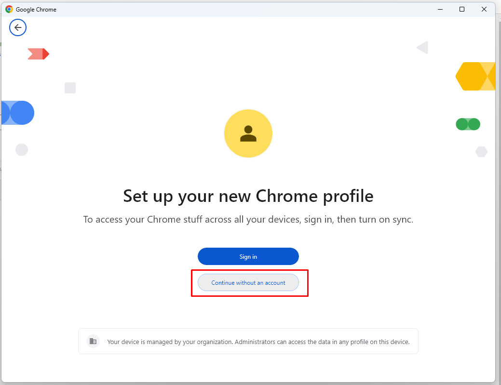

## Learning Objectives
1. Ensure that you have access to the email with instructions and credentials to access your lab. It is an email with the subject line - WebexCC: Cisco Live Lab Access. If you do not, please ask your lab proctor now.
2. Understand your configuration instructions
3. Familiarize yourself how we will use Google Chrome profiles to simulate various scenarios covered in the next labs.

### Know before you start

1. We will be simulating situations in a **shared lab tenant**
2. The majority of the configuration in Control Hub is already set up, allowing you to focus primarily on Flow Design. Of course, there may still be some elements to adjust, but these should be minimal, letting you concentrate on building and refining the flow logic rather than spending time on initial setup.
3. The Agents have been configured for you. You will be performing the rest of the configurations to route voice calls
4. All your configurations should contain your attendee ID so the lab users don't step over each other's configurations
5. Each of you has been provided with the phone number to dial (Entry point DN), 1 agents, 1 Supervisor and 1 admin.
6. We are going to use built-in Cisco Text to Speech for playing all messages in the lab.
7. Please ask for help when you need it

TEST

  
<br/>

test text

---

### Predefined configuration

> Entry Point/Channels:  **<span class="attendee-id-container"><span class="attendee-id-placeholder" data-suffix="_Channel">Your_Attendee_ID</span>_Channel<span class="copy"></span></span>**

> Queue:  **<span class="attendee-id-container"><span class="attendee-id-placeholder" data-suffix="_Queue">Your_Attendee_ID</span>_Queue<span class="copy"></span></span>**

> Agent:   **<span class="attendee-id-container">wxcclabs+agent_ID<span class="attendee-id-placeholder" data-prefix="wxcclabs+agent_ID" data-suffix="@gmail.com">Your_Attendee_ID</span>@gmail.com<span class="copy"></span></span>**

> Supervisor:   **<span class="attendee-id-container">wxcclabs+supvr_ID<span class="attendee-id-placeholder" data-prefix="wxcclabs+supvr_ID" data-suffix="@gmail.com">Your_Attendee_ID</span>@gmail.com<span class="copy"></span></span>**

> Business Hours: **<span class="attendee-id-container"><span class="attendee-id-placeholder" data-suffix="_Bussiness_Hours">Your_Attendee_ID</span>_Bussiness_Hours<span class="copy"></span></span>**

> Webex App has been pre-installed on your Lab PC

> Assigned Inbound Channel Number: **Provided by Lab Instructor**

More pre-configured entities will be mentioned during the lab missions if they have any.

---

### Testing

All call to Webex Contact center should be done from Webex App which has been pre-installed for you as well as pre-logined to it.
To make a test just open Webex App and dial the provided Support Number assigned to you.

   

!!! Note
    International dialing is not allowed so you won't be able to dial your cell phones unless you have a US number.

---

### Browser Setup [TO BE REMOVED as we are going to pre-configure workstations prior the lab]

Since we will be using the same Chrome browser for different roles we will use the **Chrome Browser profiles** to allow multiple logins into the different components of the Webex contact center. For the control hub, use the Administrator profile created for you in the Chrome browser. Always offer Chrome to **remember your credentials and password** for this lab. We will create the user profiles below - Admin, Agent 1, Agent 2 and Supervisor




---

### Creating Chrome user profiles

Open the Windows Terminal (Windows key and type **Powershell**). Paste and run the following code. You will see 4 new Chrome shortcut icons on the desktop

```
$DesktopPath = [Environment]::GetFolderPath("Desktop")
$shell = New-Object -ComObject WScript.Shell
$shortcut = $shell.CreateShortcut("$DesktopPath\WxCC Admin.lnk")
$shortcut.TargetPath = "%PROGRAMFILES%\Google\Chrome\Application\chrome.exe"
$Shortcut.Arguments = "--user-data-dir=%USERPROFILE%\chromeProfiles\admin"
$Shortcut.Save()
$shortcut = $shell.CreateShortcut("$DesktopPath\WxCC Agent1.lnk")
$shortcut.TargetPath = "%PROGRAMFILES%\Google\Chrome\Application\chrome.exe"
$Shortcut.Arguments = "--user-data-dir=%USERPROFILE%\chromeProfiles\Agent1"
$Shortcut.Save()
```


Check the desktop of your lab PC. You should find 3 Chrome shortcuts created - WxCC Admin, **WxCC Agent1 and WxCC Supervisor**

When you click on the links 


You can customize each profile to be easily identifiable with a name and/or icon of your choice


We will use the **Admin** profile first in the next section.

<script src='../template_assets/load.js'><script>